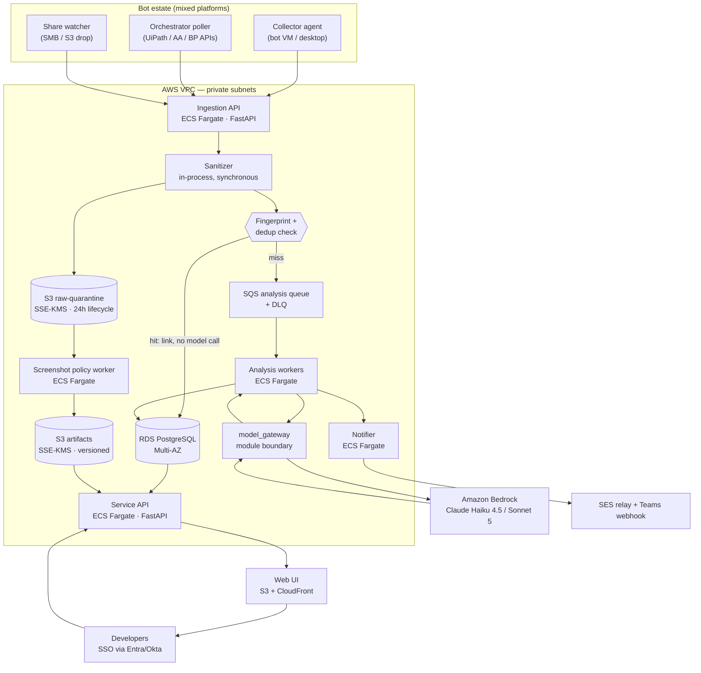

# Eagle Eyes — Architecture

RPA failure analyzer. Correlates three inputs per bot failure (source code, execution log,
error screenshot) and produces a root-cause diagnosis plus a suggested fix.

**Status:** design, pre-implementation. Nothing in this document has been built.

---

## 1. The decision that shapes everything else

The screenshot question — may a raster image of a client application reach the model? — is
unanswered pending security review (see `SECURITY.md`). The prompt kit warns that settling it
late means a rewrite.

**It does not have to.** The design below makes screenshot disposition a *runtime policy mode*
rather than a structural assumption. Four modes, one code path:

| Mode | Screenshot reaches | Model sees | Requires |
|---|---|---|---|
| **0 — Quarantine** | S3, encrypted, access-gated | nothing | nothing (default) |
| **1 — Crop** | S3 + cropped error region to model | error dialog only | security sign-off |
| **2 — Redact** | S3 + OCR-redacted full image | masked image | security sign-off |
| **3 — Passthrough** | S3 + image as captured | full image | contract + DPA |

Every mode uses the same ingestion, the same storage, the same retention job, and the same
analysis engine. Modes differ only in what the `ScreenshotPolicy` module returns to the analysis
worker. The system is built for Mode 0 and unlocks upward.

This is the single most important structural choice in the document, and it exists specifically
so Phase 1 can ship while the security conversation is still open.

**The honest cost of this approach:** Mode 0 ships a system whose vision capability — the thing
that motivated the production upgrade — is dormant. We will be running text-only analysis and
showing the screenshot to humans. If security ultimately lands on Mode 0 permanently, we will
have built a vision pipeline we never use. That is a real risk and it is stated here rather than
buried; it is still cheaper than blocking delivery for a sign-off of unknown duration.

---

## 2. Component diagram



---

## 3. Component choices and why

### Ingestion — three collectors, one contract

Your bots are not on a single platform: logs come from local desktop text files, from cloud
Orchestrators, or from other RPA tools. So ingestion cannot assume one source.

All three collectors emit the same normalized `FailureEvent` envelope. Everything downstream
depends only on that envelope, never on the platform.

```
FailureEvent {
  source_platform   : "uipath" | "automation_anywhere" | "blue_prism" | "generic"
  bot_id            : str          # stable per automation
  run_id            : str
  occurred_at       : datetime
  log_text          : str          # raw, pre-sanitization
  code_ref          : { repo, path, commit_sha, line_hint }
  screenshot_ref    : { s3_key, captured_at } | null
  platform_extras   : dict         # opaque, never parsed by core
}
```

| Collector | When to use | Why |
|---|---|---|
| **Agent** (small Python service on the VM) | Local desktop bots writing text logs | Only option when there is no central API. Tails a log dir, posts on failure. |
| **Orchestrator poller** | UiPath / AA / Blue Prism with a Control Room API | No 150-VM software rollout. Pull-based, one deployment, central credentials. Prefer this wherever the platform offers it. |
| **Share watcher** | Bots already dropping artifacts to SMB/S3 | Zero bot-side change at all. Cheapest onboarding path. |

*Alternative rejected:* a single universal agent on every VM. It is the most capable option and
the most expensive — deploying and updating software on hundreds of managed bot VMs needs IT
change control for every release. Pull-based wherever possible is the boring choice.

### Compute — ECS Fargate, not Kubernetes, not Lambda

Two long-lived services (API, notifier) and one scaling worker pool. Fargate gives autoscaling
without a control plane to run.

- *Not EKS:* there is no workload here that needs it, and it adds a permanent operator burden to
  a small team. The kit explicitly asked for this justification: we have three services, not
  thirty. EKS would be the single largest maintainability mistake available to us.
- *Not Lambda:* analysis calls run tens of seconds and hold a large prompt; deep analysis with
  retries can approach the 15-minute ceiling. Container images also keep prompt assets and the
  Bedrock SDK in one artifact. Lambda would work for ingestion alone, but splitting runtimes for
  one component is not worth the second deployment story.
- *Not EC2:* patching and AMI lifecycle for no gain at this size.

### Queue — SQS standard + DLQ

Spiky load (hundreds of failures in minutes) is exactly the buffering case. SQS is managed,
cheap, and has a dead-letter queue we get for free.

*Not FIFO:* ordering does not matter — each failure is independent, and dedup is handled by
fingerprint in Postgres, not by queue semantics. Standard SQS's at-least-once delivery is safe
because analysis writes are idempotent on `(fingerprint, code_commit_sha)`.

*Not Kafka/MSK:* one producer, one consumer group, no replay requirement, no stream processing.
MSK costs more per month than the entire model spend projected in `COST_MODEL.md`.

### Database — RDS PostgreSQL, Multi-AZ

Relational data with real foreign keys (failures → analyses → feedback → bots → developers).
Postgres gives us JSONB for `platform_extras`, a normal B-tree index on the fingerprint column,
and full-text search on logs later if wanted.

*Not DynamoDB:* our access patterns are ad-hoc and analytical (the operations dashboard slices by
bot, by time, by category, by cost). That is a SQL workload.

### Storage — S3, two buckets, deliberately separated

- `eagle-eyes-quarantine` — raw uploads land here. SSE-KMS, 24-hour lifecycle expiry, bucket
  policy denies every principal except the policy worker's task role. Nothing else can read it.
- `eagle-eyes-artifacts` — sanitized/processed artifacts. SSE-KMS, versioned, retention per
  `DATA_MODEL.md`.

Two buckets rather than two prefixes because bucket-level policy is the control that is hardest
to misconfigure by accident. A prefix-based IAM condition is one typo away from exposing raw
images; a separate bucket with an explicit deny is not.

### Model access — Amazon Bedrock

Per your decision. Bedrock keeps inference inside your AWS account and region, which is the
strongest available answer to "where does client data go" — the question that will dominate the
security review. Model IDs carry the `anthropic.` prefix (e.g. `anthropic.claude-sonnet-5`).

**Verify before quoting to security:** the exact data-handling terms for Bedrock model inference,
in writing, from current AWS documentation and your enterprise agreement. Do not assert retention
behaviour from memory or from this document — `SECURITY.md` lists this as a blocking question.

### Model boundary — `model_gateway`

One module. Nothing outside it imports `anthropic`, `boto3.client("bedrock-runtime")`, or any
provider type. Its public surface is:

```
triage(log, code_summary)                  -> TriageResult
analyze_text(log, code)                    -> Analysis
analyze_with_vision(log, code, image)      -> Analysis
```

Swapping provider or moving off Bedrock touches this module and nothing else. Enforced in CI by a
lint rule that fails the build on provider imports outside `model_gateway/`.

---

## 4. Where redaction happens, and why there

**Answer: in a dedicated policy worker, inside the VPC, reading from the quarantine bucket —
after upload, before any other component can read the image.**

The candidates, and the reasoning:

| Where | Argument for | Why not chosen |
|---|---|---|
| On the bot VM, before upload | Raw pixels never leave the endpoint. Strongest theoretical position. | Requires OCR + ML on hundreds of production bot VMs, competing with the bot for resources. Every redaction-logic fix becomes an estate-wide software rollout through IT change control. A redaction bug then persists for weeks. |
| **Policy worker in VPC (chosen)** | One place to fix, audit, and test. Raw image exists only in a locked bucket with a 24h lifecycle. Redaction logic versions with the app. | Raw pixels transit the network and rest briefly in S3. Mitigated: TLS in transit, SSE-KMS at rest, bucket policy denying all but one task role, 24h expiry, and every access audited. |
| In the analysis worker | Fewest moving parts. | The analysis worker also talks to Bedrock. A bug there could put an unredacted image on the wire. Separating the component that *can* reach the model from the component that *handles raw pixels* is the whole point. |
| At the model boundary | Last possible chokepoint. | Too late — the raw image would already be stored and readable by the API and UI. |

The separation is the control: **the policy worker can read raw and cannot call Bedrock; the
analysis worker can call Bedrock and cannot read raw.** Enforced by IAM task roles, not by code
discipline. Two distinct task roles, two distinct bucket policies.

---

## 5. Data flow for one failure, with the control at each hop

| # | Hop | Security control |
|---|---|---|
| 1 | Bot fails; RPA tool writes log + screenshot | Local disk, existing estate controls. Out of our trust boundary. |
| 2 | Collector posts `FailureEvent` | mTLS or SigV4. Per-collector credential. Size limits enforced before body is read. |
| 3 | Ingestion API receives | AuthN on the collector identity. Payload schema validated. Oversize rejected with 413, not truncated. |
| 4 | **Sanitizer runs synchronously** | Log + code scrubbed for PII and credentials *before* the first durable write. Raw log text is never persisted. |
| 5 | Screenshot bytes → quarantine bucket | SSE-KMS. Bucket policy: policy-worker task role only. 24h lifecycle expiry. Object-level access logged. |
| 6 | Fingerprint computed; dedup checked | Fingerprint derives from sanitized text only. No model call. No network egress. |
| 7a | **Dedup hit** → link to existing analysis | No model call, no cost, no new PII exposure. Terminal for this event. |
| 7b | Dedup miss → enqueue | SQS message carries IDs only, never content. Encrypted at rest. |
| 8 | Policy worker processes screenshot | Applies Mode 0–3. Writes result to artifacts bucket. Deletes quarantine object immediately on success rather than waiting for lifecycle. |
| 9 | Analysis worker → `model_gateway` | Budget guard checked *before* the call. Worker's IAM role cannot read quarantine. |
| 10 | `model_gateway` → Bedrock | In-region, in-account. Prompt asserts inputs are untrusted data, not instructions. |
| 11 | Response schema-validated | Malformed → safe fallback record. Never a fabricated diagnosis rendered as confident. |
| 12 | Analysis persisted | Postgres, encrypted at rest. Row-level authorization metadata written with it. |
| 13 | Notification sent | Diagnosis text only. **Never** an embedded screenshot — a link into the UI, where access control applies. |
| 14 | Developer opens UI | SSO. Authorization at the data layer. Screenshot view separately gated and separately audited. |

---

## 6. Degradation: graceful vs hard failure

Design rule: **never lose a failure event, and never guess.**

### Degrades gracefully

| Condition | Behaviour |
|---|---|
| Bedrock unavailable / 429 | Message returns to SQS with backoff. After max receives → DLQ. Failure row persists as `analysis_pending`. UI shows "analysis pending", not an error. |
| Screenshot missing or corrupt | Analysis proceeds text-only, flagged `inputs_used: [log, code]`. A missing image degrades quality, never blocks diagnosis. |
| Code fetch fails (repo unreachable) | Analysis proceeds on log alone, confidence capped lower, `inputs_used` reflects it. |
| Schema validation fails on model output | One retry with a repair instruction, then a fallback record stating analysis was inconclusive. Never a fabricated answer. |
| Budget exhausted | New analyses stop; ingestion, dedup, and template responses continue. Dedup hits and known patterns still serve value at zero model cost. |
| Notification delivery fails | Retried, then queued for digest. Analysis is already persisted and visible in the UI. |
| OCR/redaction fails (Modes 1–2) | **Fails closed** to Mode 0 for that image: quarantine object deleted, no image to the model, analysis proceeds text-only. A redaction failure must never fall through to sending the raw image. |

### Fails hard, by design

| Condition | Behaviour | Why |
|---|---|---|
| Sanitizer raises | Reject the ingest with 5xx. Collector retries. | Better to drop an event than to durably store unsanitized PII. |
| KMS unavailable | Refuse writes. | Unencrypted storage is not an acceptable degraded mode. |
| Authorization cannot be evaluated | Deny. | Fail closed, always. |
| Quarantine bucket policy check fails at startup | Service refuses to start. | A misconfigured bucket is a live data-exposure path. Catch it at boot, loudly. |
| Postgres unreachable | Ingestion returns 503; collectors retry with backoff and buffer locally. | Accepting an event we cannot record is silent data loss. |

---

## 7. Repository shape (Phase 2 will create this)

```
eagle_eyes/
  ingestion/        # API, validation, collectors' server side
  sanitize/         # log + code scrubbing
  screenshot/       # ScreenshotPolicy — modes 0-3
  fingerprint/      # normalization + hashing
  analysis/         # triage, routing, escalation gate
  model_gateway/    # ONLY place importing a model SDK
  prompts/          # version-controlled prompt files
  storage/          # repositories, migrations
  api/              # service API, authz, audit
  notify/           # email, Teams, suppression
  web/              # UI
docs/
```

---

## 8. Open architectural questions

Carried into `OPEN_QUESTIONS.md` — listed here because they affect this document directly:

1. Which platforms are actually in Phase 1 scope? The adapter design absorbs the answer, but each
   adapter is real work and the pilot should carry exactly one.
2. Can bot source be fetched from version control at analysis time, or must the collector ship a
   code snapshot? Affects whether the analysis worker needs repo credentials.
3. Is there an existing SIEM/log platform (Splunk, Sentinel) that should receive audit events
   rather than us building retention for them?
4. Does the RPA tool's screenshot capture already support a "capture error dialog only" option?
   If yes, Mode 1 gets dramatically cheaper and safer at the source.
