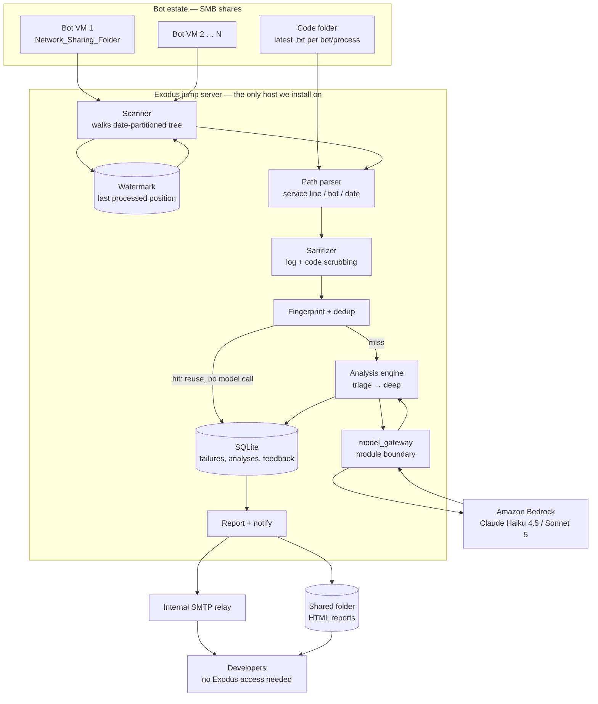

# Eagle Eyes — Architecture

RPA failure analyzer for iBot. Correlates three inputs per failure (bot code, execution log, error
screenshot) and produces a root-cause diagnosis plus a suggested fix.

**Status:** design, pre-implementation.

---

## 1. Deployment model — one host, three shares

This replaces an earlier draft that assumed a collector on every bot VM. The real environment makes
that unnecessary.

- Every bot VM runs iBot and writes logs and screenshots to local disk.
- **Network sharing is enabled on each VM**, so those folders are readable over SMB.
- Developers work through **Exodus**, a jump server, and open bot VMs remotely from there.
- The latest code for every bot and process lives in **one shared folder**, maintained manually
  (iBot has only a copy function, so code is pasted into Notepad and saved as `.txt`).

So the analyzer is **a single application installed on Exodus** that reads three folder trees. It is
not a distributed system.

```
Bot VM shares  ──SMB──┐
Code folder    ──SMB──┼──► Eagle Eyes on Exodus ──HTTPS──► Bedrock
Screenshot dirs──SMB──┘            │
                                   ├──► SMTP relay ──► developer inbox
                                   └──► HTML reports ──► shared folder
```

### Why this is better than what I proposed before

| | Previous draft | This design |
|---|---|---|
| Software on bot VMs | Agent on every VM | **None** |
| Change control | Every emitter release | **Once, on one host** |
| Outbound to AWS | Hundreds of VMs | **One host** |
| New credential locations | Every VM | **One service account** |
| New store of client PII | S3 quarantine + artifacts | **None — see §2** |
| AWS infrastructure | ECS, RDS, SQS, ALB, S3 | **Bedrock only** |

The estate-wide attack surface I flagged as unmitigable (threats T10–T12) **disappears entirely**.
That is the single biggest gain here, and it came from the environment, not from design work.

### What it costs

**The analyzer is bound to Exodus being logged in.** You confirmed the jump server has to be opened.
That makes this a scheduled job during working hours, not a 24/7 service — failures overnight are
analysed when someone next logs in. Acceptable for a pilot; a real constraint at 150 developers, and
the reason Phase 3 still needs a service somewhere that stays up.

Two consequences to design around now, cheaply:

1. **Catch-up on startup is mandatory, not optional.** The scanner must process everything since its
   last watermark, not just what is new this minute. Get this right in Phase 1 and the eventual move
   to an always-on host changes the trigger, not the logic.
2. **Developers must not need Exodus to see results.** Analyses go out by email and as HTML reports
   to a shared folder. Only the *tool* lives on the jump server; its *output* must reach people who
   will never log into it.

### Environment profiles

Local development, Exodus and the client environment are the same code with different configuration
(`LOCAL_DEV.md`). Until the real environment is available, **the client environment is simulated on a
personal machine** — local folders in place of the shares, a mock model backend in place of Bedrock.

| | `local` | `exodus` / `client` |
|---|---|---|
| Shares | `./sandbox/...` | `\\<host>\Network_Sharing_Folder` |
| Code folder | `./sandbox/code_folder` | `\\<fileserver>\code_folder` |
| Model | `mock` (no credentials, no cost) | `bedrock` |
| Notifications | log to console | SMTP relay |

Nothing branches on the environment name. Every difference is a named setting, so there is no code
path that only ever executes in production. Paths are `pathlib.Path` throughout — POSIX locally, UNC
in the estate.

**Synthetic data only.** `tools/make_fixtures.py` generates the sandbox estate. Real client
artifacts must never be copied to a personal machine; see `SECURITY.md` §11.

### The unresolved blocker

**Can Exodus reach Bedrock over outbound HTTPS?** The client has Bedrock, so the account and the
models exist. What is unconfirmed is the network path *from the jump server* — a host whose whole
purpose is to be a locked-down crossing into production, and therefore among the least likely places
to hold general internet egress.

In order of preference: a **Bedrock VPC endpoint (PrivateLink)**, which keeps traffic off the public
internet entirely and is a far easier approval than open egress; a proxy allowlist for that one
endpoint from that one host; running the analyzer on a neighbouring host that already has egress and
can reach the same shares; or a self-hosted model, which is a different project.

Local development is unblocked either way — the mock backend needs no network at all.

**Verify this in week one with one command from Exodus.** Everything downstream of ingestion assumes
it.

---

## 2. Screenshot policy — now a much stronger position

Screenshot disposition remains a runtime mode, and Phase 1 still ships in Mode 0. What changed is
what Mode 0 now *means*.

| Mode | What the model sees | What we copy |
|---|---|---|
| **0 — Reference only (default)** | nothing | **nothing** |
| 1 — Crop | error region | a cropped derivative |
| 2 — Redact | masked image | a redacted derivative |
| 3 — Passthrough | full image | the image as captured |

**In Mode 0 the analyzer never copies a screenshot anywhere.** It reads the image only to record its
path, dimensions and existence. The file stays on the bot VM share, under the ACLs the estate
already applies. The report links to the UNC path; an authorized developer opens it the same way
they open any other file today.

This removes the entire S3 quarantine design, the 24-hour lifecycle, the dual-bucket IAM separation,
and the retention job for images — **because there is no second copy to secure or delete.** The
strongest control available is not storing the data, and this environment gives us that for free.

It also changes the security conversation. "Do we have permission to copy client screenshots into a
cloud bucket?" becomes "we read a file that is already there, and send nothing." A materially easier
position to defend, and the one to lead with.

Modes 1–3 reintroduce derivative copies and are gated on `SECURITY.md` §9 Q1/Q2 as before.

---

## 3. Component diagram



---

## 4. Path convention and correlation

### 4.1 The tree

```
Network_Sharing_Folder/
  data/
    <service line>/
      <bot number>/
        <year>/
          <month>/
            <date>/
              logs/
                user logs/
                  logs/          ← execution logs
                  screenshot/    ← error screenshots
```

This is configuration, not a constant. Store it as a template so a structure change is a config
edit rather than a code change:

```yaml
tree_template: "data/{service_line}/{bot_number}/{year}/{month}/{day}/logs/user logs"
logs_subdir: "logs"
screens_subdir: "screenshot"
```

### 4.2 What the path gives us for free

Three identifiers, with no parsing of file contents at all:

| From path | Used for |
|---|---|
| `service_line` | Routing and authorization grouping |
| `bot_number` | **Bot identity — the join key to the code folder** |
| `year/month/day` | Incremental scanning (§4.3) and ordering |

That is a genuinely good property of this layout. In most RPA estates bot identity has to be
inferred from log content; here it is structural, so it cannot be wrong.

### 4.3 Incremental scanning

Date partitioning means we never walk the whole tree. The scanner visits today's folder, plus a
configurable lookback (default 3 days) for files that land late, and skips anything at or before the
watermark.

The watermark is `(bot_number, file_path, mtime, size)` per processed file, held in SQLite. It must
survive restarts, because the jump server is logged out routinely. On startup the scanner catches up
from the watermark rather than starting from now — without this, every overnight failure is lost the
first time nobody logs in.

### 4.4 Correlation, and the part that is still unknown

Log and screenshot sit in **sibling folders under the same date**, so they are already narrowed to
one bot on one day. What is not yet known is how to pair a *specific* log with a *specific*
screenshot inside that day.

Three possibilities, in descending reliability:

1. **A shared run ID in both filenames** — exact, trivial, no ambiguity. Best case.
2. **A run ID inside the log body** that names its screenshot — also exact, needs parsing.
3. **Timestamp proximity only** — fragile. Two failures on one bot within the pairing window get
   mismatched, and a mismatched screenshot produces an analysis of the wrong screen presented with
   full confidence. That is the "confidently wrong" failure mode this project cannot afford.

If it turns out to be (3), the rule is: pair only within a tight window (default 5s), and where two
candidates fall inside the window, **attach no screenshot and mark the failure text-only.** Refusing
to guess is cheap; guessing wrong is expensive.

**To settle this I need one real directory listing** — a `dir /s` of one date folder, filenames only,
plus one sample log file with client data removed. That resolves in minutes what discussion cannot.

### 4.5 Code, and the drift problem

`bot_number` from the path maps to a file in the code folder. The exact naming convention is an open
question (`OPEN_QUESTIONS.md` D7).

The real issue is subtler. The code folder holds the **latest** code, saved manually. A failure from
Tuesday may have run against code that was edited on Wednesday. Nothing in a hand-saved `.txt` file
records which version the bot was actually running.

There is no way to fix this without version control, so the design compensates rather than pretends:

- Use the code file's **mtime as a pseudo-version**.
- If `code_file.mtime > failure.occurred_at`, the code changed after the failure. Flag the analysis
  `code_possibly_stale`, cap its confidence, and say so in the report.
- Dedup reuse (`DATA_MODEL.md` §2.6) keys on that mtime instead of a commit SHA, so a code edit
  correctly invalidates prior analyses for that bot.
- Track staleness rate as a metric. If it is high, that is the evidence for asking iBot to gain a
  real export, or for putting the code folder under version control.

**This is the weakest input in the system** and should be stated plainly to anyone reading an
analysis: the diagnosis may be reasoning about code the bot was not running.

---

## 5. Component choices

### Application — a single Python service, installed once

Packaged as a Windows service (or Scheduled Task) on Exodus. One process, one config file, one log.

*Not a distributed system:* there is one host and one reader. Introducing a queue, workers, and a
control plane here would add operational surface with nothing to show for it.

### Storage — SQLite

One writer, one host, tens of thousands of rows a year (`DATA_MODEL.md` §6). SQLite in WAL mode is
comfortably sufficient and needs no server, no backup agent, and no DBA.

*Not Postgres:* it would be the right answer for the multi-user service in Phase 3, and the schema is
written to port cleanly. It is the wrong answer for a single-host tool today.

The database file lives on Exodus and holds sanitized logs and analyses, so it inherits the jump
server's existing access controls and backup regime — which is why §6 of `SECURITY.md` now treats
Exodus itself as in-scope for the threat model.

### Queue — none

Work is a bounded list of files discovered by a scan. A SQLite job table with a `status` column gives
retry and crash recovery; SQS would be a network dependency for a loop that runs in-process.

### Model access — Bedrock, behind `model_gateway`

One module. Nothing outside it imports a model SDK. Public surface:

```
triage(log, code_summary)              -> TriageResult
analyze_text(log, code)                -> Analysis
analyze_with_vision(log, code, image)  -> Analysis
```

Bedrock model IDs carry the `anthropic.` prefix (`anthropic.claude-sonnet-5`). If Exodus turns out to
have no egress (§1), this module is the only thing that changes.

### Output — email first, reports second

- **Email via the internal relay**, to the developer responsible for the bot. Reaches people who
  never touch Exodus, which is the whole point.
- **HTML report per failure** written to a shared folder, linked from the email.
- Screenshot is **never embedded** — the report links to the UNC path, so the estate's existing file
  ACLs decide who can open it.

*Not a web UI in Phase 1:* a web app on a jump server that has to be logged into serves almost
nobody. Static reports on a share reach everyone today. The UI arrives in Phase 3 alongside a host
that stays up.

---

## 6. Data flow for one failure

| # | Step | Control |
|---|---|---|
| 1 | iBot writes log + screenshot to the VM's local disk | Existing estate controls |
| 2 | Scanner finds the file over SMB, past the watermark | Read-only service account; no write access to VM shares |
| 3 | Path parsed → service line, bot number, date | Structural, not inferred |
| 4 | Log read and **sanitized before any durable write** | Raw log text never persisted |
| 5 | Code resolved from the code folder by bot number; scrubbed | Secrets redacted; mtime captured as pseudo-version |
| 6 | Screenshot **referenced, not copied** (Mode 0) | Path, size and dimensions only — no second copy exists |
| 7 | Fingerprint computed; dedup checked | Local, no model call, no egress |
| 8a | Hit → reuse analysis | Zero cost. Terminal. |
| 8b | Miss → triage, then deep analysis | Budget guard checked **before** each call |
| 9 | `model_gateway` → Bedrock | Prompt asserts inputs are untrusted data, not instructions |
| 10 | Response schema-validated | Malformed → safe fallback, never a fabricated diagnosis |
| 11 | Analysis stored in SQLite | On Exodus, under its access controls |
| 12 | Email + HTML report emitted | Diagnosis text only; screenshot by link |
| 13 | Developer opens the screenshot if needed | Existing share ACLs apply — unchanged from today |

---

## 7. Degradation

**Never lose a failure, never guess.**

### Degrades gracefully

| Condition | Behaviour |
|---|---|
| A VM share is unreachable | Skip that bot, record the gap, continue with the others. One offline VM must not stall the run. |
| Bedrock unreachable / 429 | Leave the job `pending` with backoff. Watermark is **not** advanced, so the next run retries. |
| Screenshot missing | Analyse text-only, flag `inputs_used`. |
| Code file missing for a bot | Analyse on log alone, cap confidence, flag it. |
| Code file newer than the failure | Proceed, mark `code_possibly_stale`, cap confidence (§4.5). |
| Ambiguous log↔screenshot pairing | Attach no screenshot; text-only (§4.4). |
| Malformed model output | One repair retry, then a fallback record stating analysis was inconclusive. |
| Budget exhausted | Stop new analyses; dedup hits and template responses continue. |
| Email relay down | Report still written to the share; email retried next run. |
| Exodus logged out for a day | Catch-up scan on next start processes the backlog (§4.3). |

### Fails hard

| Condition | Behaviour | Why |
|---|---|---|
| Sanitizer raises | Abort that failure, log the path, continue | Better to skip one than to store unsanitized PII |
| SQLite unwritable | Stop the run | Advancing a watermark we cannot record means silent data loss |
| Config points at a writable VM share path | Refuse to start | The analyzer must be read-only against the estate; catch it at boot |
| Code folder path resolves outside its configured root | Refuse | Guards against a path-traversal bug reading arbitrary files |

---

## 8. Repository shape

```
eagle_eyes/
  scan/             # tree walk, watermark, path parsing
  correlate/        # log <-> screenshot <-> code pairing
  sanitize/         # log + code scrubbing
  screenshot/       # ScreenshotPolicy — modes 0-3
  fingerprint/      # normalization + hashing
  analysis/         # triage, routing, escalation gate
  model_gateway/    # ONLY place importing a model SDK
  prompts/          # version-controlled prompt files
  storage/          # SQLite schema, migrations, repositories
  report/           # HTML rendering, email
  config/           # path templates, modes, budgets
docs/
```

---

## 9. Open architectural questions

1. **Can Exodus reach Bedrock over outbound HTTPS?** The blocker. One command settles it (§1).
2. **How are a log and its screenshot paired within a date folder?** Needs one real directory
   listing. Determines whether screenshots are usable at all (§4.4).
3. **What is the code folder's naming convention**, and how does `bot_number` map to a file (§4.5)?
4. **Does the analyzer run with a service account, or only in an interactive session?** Changes
   scheduling but not the design — the catch-up scan covers both.
5. **Who keeps the code folder current, and how often does it drift?** Sets how much to trust the
   code input, and whether the staleness flag will fire constantly.
6. **Does the internal SMTP relay accept mail from Exodus** without a new firewall rule?
