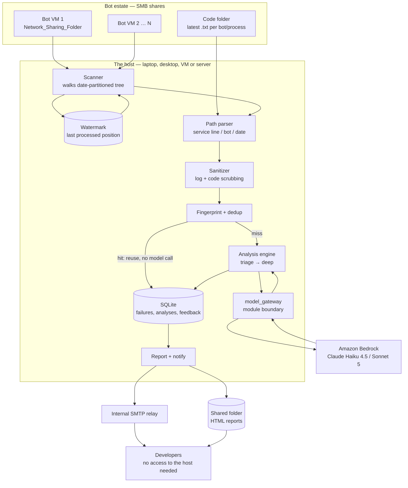

# Eagle Eyes — Architecture

RPA failure analyzer for iBot. Correlates three inputs per failure (bot code, execution log, error
screenshot) and produces a root-cause diagnosis plus a suggested fix.

**Status:** design, pre-implementation.

---

## 1. Deployment model — an ordinary application, installed anywhere

Eagle Eyes is a normal desktop/server application. It runs wherever you put it:
a developer's **laptop**, a **desktop**, a **VM**, a **build agent**, a **jump server**, a
**file server** — on Windows, Linux or macOS, installed or portable from a folder.

**No host is special.** Earlier drafts of this document treated one machine (a jump server called
Exodus) as the architecture. That was wrong: it is one host where the application may be
convenient to run, not a structural assumption. Anything built around a single named machine has to
be rebuilt the first time someone else needs it.

### What it actually needs

| Requirement | Why |
|---|---|
| Python 3.11+, or the packaged build | No admin rights needed for the portable form |
| **Read** access to the logs and screenshots | Any path: local folder, mapped drive, UNC, NFS mount, synced folder |
| **Read** access to the code folder | Same |
| A writable place for its own data | Platform default, or anywhere via `EAGLE_EYES_DATA_DIR` |
| Network reach to a model endpoint | Bedrock or the Claude API (§5) |

That is the whole list. No service account is required unless you want unattended runs, no database
server, no admin install, no inbound ports.

### Where its data goes

Never a hardcoded path. `eagle_eyes/runtime.py` resolves it per platform:

| | |
|---|---|
| Windows | `%LOCALAPPDATA%\EagleEyes\` |
| macOS | `~/Library/Application Support/EagleEyes/` |
| Linux | `$XDG_DATA_HOME/eagleeyes/` or `~/.local/share/eagleeyes/` |
| Portable | `data/` beside the application, when a `portable.txt` marker is present |
| Override | `EAGLE_EYES_DATA_DIR` |

Portable mode exists for locked-down desktops, USB sticks, and anywhere an install is unwelcome.

Config is searched most-specific-first — explicit flag, `EAGLE_EYES_CONFIG`, the working directory,
the user config directory, then beside the application — so one shared config can live on a network
path while any single machine still overrides it.

### Sources are just paths

```
\\fileserver\Network_Sharing_Folder\data     UNC
Z:\data                                      mapped drive
C:\bots\data                                 local
/mnt/bots/data                              POSIX mount
~/sandbox/Network_Sharing_Folder/data       local development
```

All five are handled identically. Whether a source happens to be a network path affects retry and
timeout behaviour, nothing else.

### The consequence of running anywhere: dedup fragments

One install, one SQLite database, one dedup cache — fine. **Ten installs means ten caches**, so the
same failure is analysed ten times, and the primary cost control quietly stops working.

Measured against `COST_MODEL.md`, at 2,000 failures/day: one shared store gives a 70% hit rate and
about **$16.63/day**. Spread across ten installs the effective rate falls to roughly 7% and the cost
rises to about **$51.55/day** — for identical information.

**Putting the SQLite database on the share is not the fix.** SQLite over SMB is a documented way to
corrupt a database: its locking relies on byte-range locks that network filesystems implement
inconsistently or not at all, and the failure is silent until it is total.

**The fix is a separate shared cache** (`eagle_eyes/cache.py`): one small JSON file per fingerprint
in a sharded directory on a path every install can reach. Reads are plain file reads with no
locking. Writes go to a temporary file in the same directory and are renamed into place — atomic on
NTFS and POSIX alike — so a reader sees the old file or the new one, never a half-written one. Two
installs writing the same fingerprint is harmless, because the content is a function of the
fingerprint.

It is always optional. An unreachable share, an offline laptop, a path that does not exist: all
degrade to "no cache", which costs money and breaks nothing. And a configured root that **does not
exist is reported, never created** — a typo'd share path that silently became a private cache would
have every install reporting a healthy cache while each paid full price.

### Two operating modes, one code path

The analyzer runs either way, and the difference is a flag rather than a build:

| | **Interactive** | **Scheduled** |
|---|---|---|
| Started by | a person, on whatever machine they use | Task Scheduler, cron, or a service |
| Scope | whatever they pick — one log, a date, a bot, a service line | a configured path |
| Before running | a review table they can change | nothing; runs what it finds |
| Flag | *(default)* | `--yes` |

Interactive is the primary mode for the pilot: a developer already knows which bot they are chasing,
and a scheduled sweep gives them no way to say "not that one, this one." Scheduled suits an always-on
host once the pilot settles.

**Discovery is read-only and costs nothing**, so the review can always be shown before anything is
sent. `--dry-run` stops there.

### The user decides, the system proposes

Pairing and code resolution are **proposals with their reasoning shown**, never silent decisions.
Every one can be overridden in the review:

| | |
|---|---|
| `3`, `3-9`, `a`, `n` | select rows, ranges, all, none |
| `v 3` | send or withhold the screenshot for one row |
| `s 3` | attach a different screenshot |
| `c 3` | attach a different code file |
| `f 3` | re-analyse even though it was analysed before |
| `d 3` | show everything known about a row, including why the screenshot was paired |

The review also states the **upper-bound cost before anything is sent** — what the run would cost if
nothing dedups, which is the worst case. Real cost is normally far lower.

Two things this exists to prevent. A developer who cannot see *why* a screenshot was attached cannot
catch it being the wrong one, so `pairing_method` and its reasoning are in the table, not buried. And
a tool that analyses a whole service line because someone pointed one level too high, without saying
what that will cost, gets switched off after the first surprise.

Selection is entered three ways, in order of what the machine supports: a **folder/file dialog**
(tkinter, bundled with Windows Python), a **numbered text browser** (works over RDP with no display,
and in CI), and **command-line arguments** for the scheduler. All three converge on the same review.

### Environment profiles

Local development and the client environment are the same code with different configuration
(`LOCAL_DEV.md`). Until the real environment is available, development runs **real Bedrock calls
against a wholly synthetic estate** — local folders in place of the shares, fabricated logs,
screenshots and code. Real model behaviour, and no client data anywhere, so it needs no sign-off to
begin.

| | `local` | `host` / `client` |
|---|---|---|
| Shares | `./sandbox/...` | `\\<host>\Network_Sharing_Folder` |
| Code folder | `./sandbox/code_folder` | `\\<fileserver>\code_folder` |
| Model | `bedrock` — **real calls, synthetic inputs** (`mock` in CI) | `bedrock` |
| Notifications | log to console | SMTP relay |

Nothing branches on the environment name. Every difference is a named setting, so there is no code
path that only ever executes in production. Paths are `pathlib.Path` throughout — POSIX locally, UNC
in the estate.

**Synthetic data only.** `tools/make_fixtures.py` generates the sandbox estate. Real client
artifacts must never be copied to a personal machine; see `SECURITY.md` §11.

### The unresolved blocker

**Can the host you choose reach a model endpoint over outbound HTTPS?** The client has Bedrock, so
the account and the models exist; what is unconfirmed is the network path from wherever this runs.
This is worth checking per host rather than once: a developer laptop on the corporate network and a
hardened jump server have very different egress rules, and a jump server — whose whole purpose is to
be a locked-down crossing into production — is among the least likely places to hold general egress.

In order of preference: a **Bedrock VPC endpoint (PrivateLink)**, which keeps traffic off the public
internet entirely and is a far easier approval than open egress; a proxy allowlist for that endpoint;
**running the analyzer on a different host that already has egress** and can reach the same paths —
which is now simply a matter of installing it somewhere else; or a self-hosted model, which is a
different project.

`tools/check_model.py` settles it in one command per host, and names which link is broken when it
fails. Run it wherever you intend to install.

**Verify this in week one with one command from the host.** Everything downstream of ingestion assumes
it.

---

## 2. Screenshot policy — now a much stronger position

Screenshot disposition remains a runtime mode, and Phase 1 still ships in Mode 0. What changed is
what Mode 0 now *means*.

| Mode | What the model sees | What we copy |
|---|---|---|
| **0 — Reference only (default)** | nothing | **nothing** |
| 1 — Crop | error region | a cropped derivative |
| 2 — Redact | masked image | a redacted derivative |
| 3 — Passthrough | full image | the image as captured |

**In Mode 0 the analyzer never copies a screenshot anywhere.** It reads the image only to record its
path, dimensions and existence. The file stays on the bot VM share, under the ACLs the estate
already applies. The report links to the UNC path; an authorized developer opens it the same way
they open any other file today.

This removes the entire S3 quarantine design, the 24-hour lifecycle, the dual-bucket IAM separation,
and the retention job for images — **because there is no second copy to secure or delete.** The
strongest control available is not storing the data, and this environment gives us that for free.

It also changes the security conversation. "Do we have permission to copy client screenshots into a
cloud bucket?" becomes "we read a file that is already there, and send nothing." A materially easier
position to defend, and the one to lead with.

Modes 1–3 reintroduce derivative copies and are gated on `SECURITY.md` §9 Q1/Q2 as before.

---

## 3. Component diagram



---

## 4. Path convention and correlation

### 4.1 The tree

```
Network_Sharing_Folder/
  data/
    <service line>/
      <bot number>/
        <year>/
          <month>/
            <date>/
              logs/
                user logs/
                  logs/          ← execution logs
                  screenshot/    ← error screenshots
```

This is configuration, not a constant. Store it as a template so a structure change is a config
edit rather than a code change:

```yaml
tree_template: "data/{service_line}/{bot_number}/{year}/{month}/{day}/logs/user logs"
logs_subdir: "logs"
screens_subdir: "screenshot"
```

### 4.2 What the path gives us for free

Three identifiers, with no parsing of file contents at all:

| From path | Used for |
|---|---|
| `service_line` | Routing and authorization grouping |
| `bot_number` | **Bot identity — the join key to the code folder** |
| `year/month/day` | Incremental scanning (§4.3) and ordering |

That is a genuinely good property of this layout. In most RPA estates bot identity has to be
inferred from log content; here it is structural, so it cannot be wrong.

### 4.3 Incremental scanning

Date partitioning means we never walk the whole tree. The scanner visits today's folder, plus a
configurable lookback (default 3 days) for files that land late, and skips anything at or before the
watermark.

The watermark is `(bot_number, file_path, mtime, size)` per processed file, held in SQLite. It must
survive restarts, because the jump server is logged out routinely. On startup the scanner catches up
from the watermark rather than starting from now — without this, every overnight failure is lost the
first time nobody logs in.

### 4.4 Correlation — the log names the screenshot

**The log records the screenshot path at capture time:**

```
11-09-2026 09:41:09.402 [INFO ] Screenshot captured: D:\ibot\data\FINANCE_AP\BOT201\2026\09\11\logs\user logs\screenshot\2026-09-11_09-41-09.png
```

This is the outcome worth having. Pairing is **exact** — stated by the process that wrote both files —
rather than inferred from a clock. The "two failures seconds apart get mismatched" risk that shaped
earlier drafts does not arise on the primary path, and a mismatched screenshot producing a confident
analysis of the wrong screen stops being a live concern.

The filenames themselves still carry only a date and time (`2026-09-11_09-41-09.png`), which is
exactly why the log line matters.

#### Take the basename, not the path

The logged path is **the bot VM's local path**. We read over the share:

```
logged by iBot :  D:\ibot\data\FINANCE_AP\BOT201\2026\09\11\...\screenshot\2026-09-11_09-41-09.png
read by us     :  \\VM-FIN-14\Network_Sharing_Folder\data\FINANCE_AP\BOT201\2026\09\11\...\2026-09-11_09-41-09.png
```

Opening the logged path directly fails — `D:` is a drive on a machine we are not running on. The
root differs by design: the estate shares what was a local folder under a different name.

**Rule: extract the basename and resolve it inside the date folder already being scanned.** The
scanner knows the service line, bot and date from the path it walked (§4.2), so the basename is
sufficient and is immune to drive letters, root renames and any future re-share. Do not attempt to
rewrite the prefix — a mapping table is one estate change away from being wrong, and a basename
never is.

Assert the logged path's *tail* matches the folder being scanned (service line, bot, date). A
mismatch means something is wrong with the assumptions and should be recorded, not silently
accepted.

#### The rule

1. Find `Screenshot captured:` in the log, take the basename of the path it names.
2. Resolve that basename in the date folder's `screenshot/` directory →
   `pairing_method = 'log_path'`. **This is the normal path.**
3. Named but not present on the share (rotation, a failed write, a partial sync) → attach nothing,
   `pairing_method = 'none'`, and count it. A rising rate here means the share is lagging or
   screenshots are being pruned faster than we scan.
4. No capture line at all → fall back to the timestamp window: screenshots in `[T − 2s, T + 10s]`,
   attach only if exactly one candidate, otherwise attach nothing.
5. Never guess between two candidates.

Rule 4 exists because a log may not always reach the capture line — a crash during screenshot
writing, an older iBot build, a truncated file. It is a genuine fallback, not the design.

**Track the distribution of `pairing_method`.** If `log_path` is not the overwhelming majority in
Phase 1, an assumption is wrong and the vision input is less reliable than this section claims.

### 4.5 Code, and the drift problem

`bot_number` from the path maps to a file in the code folder. The exact naming convention is an open
question (`OPEN_QUESTIONS.md` D7).

The real issue is subtler. The code folder holds the **latest** code, saved manually. A failure from
Tuesday may have run against code that was edited on Wednesday. Nothing in a hand-saved `.txt` file
records which version the bot was actually running.

There is no way to fix this without version control, so the design compensates rather than pretends:

- Use the code file's **mtime as a pseudo-version**.
- If `code_file.mtime > failure.occurred_at`, the code changed after the failure. Flag the analysis
  `code_possibly_stale`, cap its confidence, and say so in the report.
- Dedup reuse (`DATA_MODEL.md` §2.6) keys on that mtime instead of a commit SHA, so a code edit
  correctly invalidates prior analyses for that bot.
- Track staleness rate as a metric. If it is high, that is the evidence for asking iBot to gain a
  real export, or for putting the code folder under version control.

**This is the weakest input in the system** and should be stated plainly to anyone reading an
analysis: the diagnosis may be reasoning about code the bot was not running.

---

## 5. Component choices

### Application — one Python process

Run it by hand, from Task Scheduler or cron, or as a service. One process, one config file, one log.

*Not a distributed system:* there is one host and one reader. Introducing a queue, workers, and a
control plane here would add operational surface with nothing to show for it.

### Storage — SQLite

One writer, one host, tens of thousands of rows a year (`DATA_MODEL.md` §6). SQLite in WAL mode is
comfortably sufficient and needs no server, no backup agent, and no DBA.

*Not Postgres:* it would be the right answer for the multi-user service in Phase 3, and the schema is
written to port cleanly. It is the wrong answer for a single-host tool today.

The database holds sanitized logs and analyses, so it inherits whatever access control and backup the
host has — which is why `SECURITY.md` treats **the host, whichever it is**, as in scope for the
threat model. A laptop and a managed server are very different in that respect, and the choice of
host is therefore a security decision (`SECURITY.md` §11a).

### Queue — none

Work is a bounded list of files discovered by a scan. A SQLite job table with a `status` column gives
retry and crash recovery; SQS would be a network dependency for a loop that runs in-process.

### Model access — Bedrock, behind `model_gateway`

One module. Nothing outside it imports a model SDK. Public surface:

```
triage(log, code_summary)              -> TriageResult
analyze_text(log, code)                -> Analysis
analyze_with_vision(log, code, image)  -> Analysis
```

Bedrock model IDs carry the `anthropic.` prefix (`anthropic.claude-sonnet-5`). If a host turns out to
have no egress (§1), this module is the only thing that changes.

### Output — email first, reports second

- **Email via the internal relay**, to the developer responsible for the bot. Reaches people who have
  no access to the analyzer's host, which is the whole point.
- **HTML report per failure** written to a shared folder, linked from the email.
- Screenshot is **never embedded** — the report links to the UNC path, so the estate's existing file
  ACLs decide who can open it.

*Not a web UI in Phase 1:* a web app is only useful from a host that stays up and that people can
reach, which may not be where this first runs. Static reports on a share reach everyone today. The
UI arrives in Phase 3 alongside an always-on host.

---

## 6. Data flow for one failure

| # | Step | Control |
|---|---|---|
| 1 | iBot writes log + screenshot to the VM's local disk | Existing estate controls |
| 2 | Scanner finds the file over SMB, past the watermark | Read-only service account; no write access to VM shares |
| 3 | Path parsed → service line, bot number, date | Structural, not inferred |
| 4 | Log read and **sanitized before any durable write** | Raw log text never persisted |
| 5 | Code resolved from the code folder by bot number; scrubbed | Secrets redacted; mtime captured as pseudo-version |
| 6 | Screenshot **referenced, not copied** (Mode 0) | Path, size and dimensions only — no second copy exists |
| 7 | Fingerprint computed; dedup checked | Local, no model call, no egress |
| 8a | Hit → reuse analysis | Zero cost. Terminal. |
| 8b | Miss → triage, then deep analysis | Budget guard checked **before** each call |
| 9 | `model_gateway` → Bedrock | Prompt asserts inputs are untrusted data, not instructions |
| 10 | Response schema-validated | Malformed → safe fallback, never a fabricated diagnosis |
| 11 | Analysis stored in SQLite | On the host, under its access controls and disk encryption |
| 12 | Email + HTML report emitted | Diagnosis text only; screenshot by link |
| 13 | Developer opens the screenshot if needed | Existing share ACLs apply — unchanged from today |

---

## 7. Degradation

**Never lose a failure, never guess.**

### Degrades gracefully

| Condition | Behaviour |
|---|---|
| A VM share is unreachable | Skip that bot, record the gap, continue with the others. One offline VM must not stall the run. |
| Bedrock unreachable / 429 | Leave the job `pending` with backoff. Watermark is **not** advanced, so the next run retries. |
| Screenshot missing | Analyse text-only, flag `inputs_used`. |
| Code file missing for a bot | Analyse on log alone, cap confidence, flag it. |
| Code file newer than the failure | Proceed, mark `code_possibly_stale`, cap confidence (§4.5). |
| Ambiguous log↔screenshot pairing | Attach no screenshot; text-only (§4.4). |
| Malformed model output | One repair retry, then a fallback record stating analysis was inconclusive. |
| Budget exhausted | Stop new analyses; dedup hits and template responses continue. |
| Email relay down | Report still written to the share; email retried next run. |
| Host asleep, off, or logged out for a day | Catch-up scan on next start processes the backlog (§4.3). |

### Fails hard

| Condition | Behaviour | Why |
|---|---|---|
| Sanitizer raises | Abort that failure, log the path, continue | Better to skip one than to store unsanitized PII |
| SQLite unwritable | Stop the run | Advancing a watermark we cannot record means silent data loss |
| Config points at a writable source path | Refuse to start | The analyzer must be read-only against the estate; catch it at boot |
| Code folder path resolves outside its configured root | Refuse | Guards against a path-traversal bug reading arbitrary files |

---

## 8. Repository shape

```
eagle_eyes/
  discovery.py      # tree walk, path parsing, log<->screenshot<->code pairing
  selection.py      # pickers, review table, user overrides
  __main__.py       # CLI: --pick-folder / --pick-file / --target / --yes
  sanitize/         # log + code scrubbing
  screenshot/       # ScreenshotPolicy — modes 0-3
  fingerprint/      # normalization + hashing
  analysis/         # triage, routing, escalation gate
  model_gateway/    # ONLY place importing a model SDK
  prompts/          # version-controlled prompt files
  storage/          # SQLite schema, migrations, repositories
  report/           # HTML rendering, email
  config/           # path templates, modes, budgets
docs/
```

---

## 9. Open architectural questions

1. **Can the chosen host reach a model endpoint over outbound HTTPS?** The blocker, and it needs
   checking per host. One command settles it (§1).
2. **How are a log and its screenshot paired within a date folder?** Needs one real directory
   listing. Determines whether screenshots are usable at all (§4.4).
3. **What is the code folder's naming convention**, and how does `bot_number` map to a file (§4.5)?
4. **Which hosts will this be installed on, and does any of them stay up?** Decides whether
   scheduled runs are useful and whether a shared dedup cache is worth configuring (§1).
5. **Who keeps the code folder current, and how often does it drift?** Sets how much to trust the
   code input, and whether the staleness flag will fire constantly.
6. **Does the internal SMTP relay accept mail from the hosts you choose** without a new rule?
