# Eagle Eyes — Architecture

RPA failure analyzer. Correlates three inputs per bot failure (source code, execution log,
error screenshot) and produces a root-cause diagnosis plus a suggested fix.

**Status:** design, pre-implementation. Nothing in this document has been built.

---

## 1. The decision that shapes everything else

The screenshot question — may a raster image of a client application reach the model? — is
unanswered pending security review (see `SECURITY.md`). The prompt kit warns that settling it
late means a rewrite.

**It does not have to.** The design below makes screenshot disposition a *runtime policy mode*
rather than a structural assumption. Four modes, one code path:

| Mode | Screenshot reaches | Model sees | Requires |
|---|---|---|---|
| **0 — Quarantine** | S3, encrypted, access-gated | nothing | nothing (default) |
| **1 — Crop** | S3 + cropped error region to model | error dialog only | security sign-off |
| **2 — Redact** | S3 + OCR-redacted full image | masked image | security sign-off |
| **3 — Passthrough** | S3 + image as captured | full image | contract + DPA |

Every mode uses the same ingestion, the same storage, the same retention job, and the same
analysis engine. Modes differ only in what the `ScreenshotPolicy` module returns to the analysis
worker. The system is built for Mode 0 and unlocks upward.

This is the single most important structural choice in the document, and it exists specifically
so Phase 1 can ship while the security conversation is still open.

**The honest cost of this approach:** Mode 0 ships a system whose vision capability — the thing
that motivated the production upgrade — is dormant. We will be running text-only analysis and
showing the screenshot to humans. If security ultimately lands on Mode 0 permanently, we will
have built a vision pipeline we never use. That is a real risk and it is stated here rather than
buried; it is still cheaper than blocking delivery for a sign-off of unknown duration.

---

## 2. Component diagram

```mermaid
flowchart TB
    subgraph Edge["Bot estate — every bot runs iBot on its own VM"]
        A0["iBot runtime<br/>writes log + screenshot to local disk"]
        A1["Emitter<br/>(iBot hook, or sidecar agent)"]
        A2["Local spool<br/>disk-capped, survives outage"]
        A0 --> A1
        A1 --> A2
        A2 --> A1
    end

    subgraph VPC["AWS VPC — private subnets"]
        B["Ingestion API<br/>ECS Fargate · FastAPI"]
        C["Sanitizer<br/>in-process, synchronous"]
        D[("S3 raw-quarantine<br/>SSE-KMS · 24h lifecycle")]
        E["Screenshot policy worker<br/>ECS Fargate"]
        F[("S3 artifacts<br/>SSE-KMS · versioned")]
        G[("RDS PostgreSQL<br/>Multi-AZ")]
        H{{"Fingerprint +<br/>dedup check"}}
        I["SQS analysis queue<br/>+ DLQ"]
        J["Analysis workers<br/>ECS Fargate"]
        K["model_gateway<br/>module boundary"]
        M["Service API<br/>ECS Fargate · FastAPI"]
        N["Notifier<br/>ECS Fargate"]
    end

    L["Amazon Bedrock<br/>Claude Haiku 4.5 / Sonnet 5"]
    O["SES relay + Teams webhook"]
    P["Web UI<br/>S3 + CloudFront"]
    Q["Developers<br/>SSO via Entra/Okta"]

    A1 -->|"HTTPS + SigV4"| B
    B --> C
    C --> D
    D --> E
    E --> F
    C --> H
    H -->|"hit: link, no model call"| G
    H -->|"miss"| I
    I --> J
    J --> K
    K --> L
    L --> K
    K --> J
    J --> G
    J --> N
    N --> O
    G --> M
    F --> M
    M --> P
    P --> Q
    Q --> M
```



---

## 3. Component choices and why

### Ingestion — iBot writes locally; something on the VM must push

**iBot is the only platform.** It runs on each bot's VM and writes the execution log and the error
screenshot to local disk on that same VM. There is no Orchestrator, no central API, no cloud
service to poll.

That removes the option the previous draft preferred. Pull-based ingestion is impossible: nothing
central holds the data. **Every failure artifact starts life on a bot VM and has to be pushed from
there.** This is the single largest consequence of the iBot decision, and it makes ingestion the
riskiest part of delivery rather than the easiest.

#### Two ways to push, and which to build first

**Option A — iBot emits the event itself (preferred end state).**
Add an HTTP POST to iBot's existing error handler. At the moment of failure, iBot already knows the
exception, already has the log handle, already writes the screenshot. It is the only component in
the system with all three facts in hand at the same instant.

- No new software on any VM. Nothing extra to deploy, patch, or monitor across the estate.
- Correlation is free — iBot knows which screenshot belongs to which failure, so we never infer it
  from filenames or timestamps.
- Owned by the iBot team, shipped through a release channel that already reaches every VM.
- *Cost:* depends on iBot's roadmap and release cadence. We do not control it.

**Option B — sidecar collector agent (the bridge).**
A small Python service on each VM watching iBot's output directory, correlating log and screenshot,
and posting.

- We control it, so Phase 1 is not blocked on another team's backlog.
- *Cost:* software on every bot VM, with IT change control on every release. Correlation is
  inferred from iBot's file-naming convention rather than known.

**Recommendation: build B, migrate to A.** Both emit the identical `FailureEvent` envelope, so the
server cannot tell them apart and the migration is a per-VM cutover with no server change. Start
the conversation with the iBot team in Phase 0 — but do not wait for it.

The point of the envelope is precisely this: it is the contract, and the thing behind it can be
replaced without touching anything downstream.

```
FailureEvent {
  emitter           : { kind: "ibot_native" | "sidecar", version: str }
  bot_id            : str          # stable per automation
  run_id            : str
  vm_hostname       : str
  occurred_at       : datetime
  log_text          : str          # raw, pre-sanitization
  code_ref          : { location, version_id, line_hint }
  code_text         : str | null   # if source is not centrally reachable
  screenshot        : bytes | null # multipart, not a reference — see below
  ibot_error        : dict         # structured error metadata, if iBot emits it
}
```

**`screenshot` is inline bytes, not a reference.** With no central store, there is nothing for a
reference to point at — the image exists only on the VM. It ships with the event or not at all.

#### The agent must own durability

With a central Orchestrator, a failed poll is retried on the next cycle and nothing is lost. With
push-from-VM, **the VM is the only copy.** If the network is down, our endpoint is unavailable, or
the VM reboots, the event is gone unless the emitter persists it.

Non-negotiable for either option:

| Requirement | Why |
|---|---|
| Local spool, disk-capped (default 500 MB), oldest-dropped-first | An outage must not fill a production bot's disk — a monitoring tool that takes a bot down is worse than no monitoring tool |
| Exponential backoff with jitter | Five hundred VMs reconnecting in lockstep after an outage is a self-inflicted spike |
| At-least-once delivery, idempotent on `(bot_id, run_id)` | Server-side dedup on the key makes retries free |
| Spool survives reboot | Bot VMs are restarted routinely |
| Emitter failure never affects the bot | Wrapped, timeout-bounded, exceptions swallowed and logged locally. **The bot's job is the business process, not telemetry.** |
| Hard CPU/memory ceiling | It shares a VM with production work |

That last pair matters more than anything else in this section. The fastest way to lose the
estate's trust — permanently — is for this system to be blamed, correctly or not, for a bot
failing. Build the emitter so it cannot plausibly be the cause.

#### Before building anything: check what is already there

Managed Windows estates usually already ship logs somewhere — a CloudWatch agent, Fluent Bit,
Splunk forwarder, SCCM, or a monitoring agent. **If one is already deployed and approved on these
VMs, extending it is dramatically cheaper than deploying ours** — the change-control argument is
already won, and screenshots may be the only genuinely new payload.

This is the first thing to check in Phase 0 (`OPEN_QUESTIONS.md` B5). It could remove the largest
single piece of Phase 1 risk.

#### iBot is ours — which changes what we can ask for

The previous draft treated the RPA tool as a fixed constraint, because with a vendor product it is.
iBot is in-house, so several hard problems become roadmap conversations with a colleague instead:

| Ask | What it buys | Where it lands |
|---|---|---|
| **Capture only the error dialog/window, not the full desktop** | The strongest available privacy win — full-screen pixels never leave the VM at all. See §4. | `SECURITY.md` §3 |
| Emit structured error metadata (exception type, stack, activity, code location) as a JSON sidecar | Fingerprinting stops being text-parsing and becomes field reads. Large accuracy gain for the primary cost control. | `DATA_MODEL.md` §2 |
| Downscale screenshots at capture (1280×720) | Less disk on the VM, less bandwidth, fewer image tokens | `COST_MODEL.md` §2 |
| Stable run ID shared by log and screenshot | Removes filename-based correlation guesswork entirely | this section |
| Native event POST | Option A above | this section |

**The structured-metadata ask is the one to push hardest on.** Everything in `DATA_MODEL.md` §2.3 —
the normalization rules, the 4-digit integer heuristic, the "this is a guess, tune it in Phase 1"
caveats — exists only because we are reverse-engineering structure out of free text. If iBot emits
the fields directly, that entire class of fragility disappears, and the dedup hit rate the cost
model rests on becomes something we can rely on instead of something we hope for.

### Compute — ECS Fargate, not Kubernetes, not Lambda

Two long-lived services (API, notifier) and one scaling worker pool. Fargate gives autoscaling
without a control plane to run.

- *Not EKS:* there is no workload here that needs it, and it adds a permanent operator burden to
  a small team. The kit explicitly asked for this justification: we have three services, not
  thirty. EKS would be the single largest maintainability mistake available to us.
- *Not Lambda:* analysis calls run tens of seconds and hold a large prompt; deep analysis with
  retries can approach the 15-minute ceiling. Container images also keep prompt assets and the
  Bedrock SDK in one artifact. Lambda would work for ingestion alone, but splitting runtimes for
  one component is not worth the second deployment story.
- *Not EC2:* patching and AMI lifecycle for no gain at this size.

### Queue — SQS standard + DLQ

Spiky load (hundreds of failures in minutes) is exactly the buffering case. SQS is managed,
cheap, and has a dead-letter queue we get for free.

*Not FIFO:* ordering does not matter — each failure is independent, and dedup is handled by
fingerprint in Postgres, not by queue semantics. Standard SQS's at-least-once delivery is safe
because analysis writes are idempotent on `(fingerprint, code_commit_sha)`.

*Not Kafka/MSK:* one producer, one consumer group, no replay requirement, no stream processing.
MSK costs more per month than the entire model spend projected in `COST_MODEL.md`.

### Database — RDS PostgreSQL, Multi-AZ

Relational data with real foreign keys (failures → analyses → feedback → bots → developers).
Postgres gives us JSONB for `platform_extras`, a normal B-tree index on the fingerprint column,
and full-text search on logs later if wanted.

*Not DynamoDB:* our access patterns are ad-hoc and analytical (the operations dashboard slices by
bot, by time, by category, by cost). That is a SQL workload.

### Storage — S3, two buckets, deliberately separated

- `eagle-eyes-quarantine` — raw uploads land here. SSE-KMS, 24-hour lifecycle expiry, bucket
  policy denies every principal except the policy worker's task role. Nothing else can read it.
- `eagle-eyes-artifacts` — sanitized/processed artifacts. SSE-KMS, versioned, retention per
  `DATA_MODEL.md`.

Two buckets rather than two prefixes because bucket-level policy is the control that is hardest
to misconfigure by accident. A prefix-based IAM condition is one typo away from exposing raw
images; a separate bucket with an explicit deny is not.

### Model access — Amazon Bedrock

Per your decision. Bedrock keeps inference inside your AWS account and region, which is the
strongest available answer to "where does client data go" — the question that will dominate the
security review. Model IDs carry the `anthropic.` prefix (e.g. `anthropic.claude-sonnet-5`).

**Verify before quoting to security:** the exact data-handling terms for Bedrock model inference,
in writing, from current AWS documentation and your enterprise agreement. Do not assert retention
behaviour from memory or from this document — `SECURITY.md` lists this as a blocking question.

### Model boundary — `model_gateway`

One module. Nothing outside it imports `anthropic`, `boto3.client("bedrock-runtime")`, or any
provider type. Its public surface is:

```
triage(log, code_summary)                  -> TriageResult
analyze_text(log, code)                    -> Analysis
analyze_with_vision(log, code, image)      -> Analysis
```

Swapping provider or moving off Bedrock touches this module and nothing else. Enforced in CI by a
lint rule that fails the build on provider imports outside `model_gateway/`.

---

## 4. Where redaction happens, and why there

**Answer: in a dedicated policy worker inside the VPC — with an ambition to move the narrowing
step onto the VM, into iBot itself, which is newly possible now that iBot is ours.**

| Where | Argument for | Verdict |
|---|---|---|
| **iBot captures only the error region** | Full-desktop pixels never exist as a file, never leave the VM, never reach S3. Nothing to redact because nothing surplus was ever captured. Geometric and auditable. | **Best available. Pursue as an iBot roadmap item** — it was not an option when the tool was a vendor product. |
| Full OCR + redaction on the VM | Raw pixels never leave the endpoint | **Still no.** OCR is CPU-heavy and would compete with production bots on their own VMs. Cropping at capture is cheap; redacting at capture is not. |
| **Policy worker in VPC (build this)** | One place to fix, audit and test. Versions with the app, not with an estate-wide rollout. | **Chosen for Phase 1/2.** Works regardless of what iBot does, and remains the fallback for any VM on an older iBot build. |
| In the analysis worker | Fewest moving parts | No — the component that handles raw pixels must not also be the component that can reach Bedrock. |
| At the model boundary | Last chokepoint | Too late; the raw image is already stored and readable. |

The separation is the control: **the policy worker can read raw and cannot call Bedrock; the
analysis worker can call Bedrock and cannot read raw.** Enforced by two IAM task roles and two
bucket policies, not by code discipline.

**These compose rather than compete.** If iBot narrows capture at source, the policy worker still
runs — it just receives a far smaller, far less sensitive image to begin with. Defence in depth,
and the server-side control does not have to be rebuilt if the iBot change slips or never ships.

## 5. Data flow for one failure, with the control at each hop

| # | Hop | Security control |
|---|---|---|
| 0 | iBot writes log + screenshot to the bot VM's local disk | Existing estate controls. Narrowing capture here (§4) is the strongest single improvement available. |
| 1 | Emitter reads both, correlates, spools locally | Spool is disk-capped and on the VM's existing encrypted volume. Emitter cannot affect the bot. |
| 2 | Emitter posts `FailureEvent` over HTTPS | SigV4 with a per-VM identity. Size limits enforced before the body is read. Backoff with jitter. |
| 3 | Ingestion API receives | AuthN on the VM identity. Schema validated. Idempotent on `(bot_id, run_id)` so retries are free. Oversize rejected with 413, never truncated. |
| 3b | Spool entry deleted **only after** a 2xx | The VM holds the sole copy until the server confirms receipt. |
| 4 | **Sanitizer runs synchronously** | Log + code scrubbed for PII and credentials *before* the first durable write. Raw log text is never persisted. |
| 5 | Screenshot bytes → quarantine bucket | SSE-KMS. Bucket policy: policy-worker task role only. 24h lifecycle expiry. Object-level access logged. |
| 6 | Fingerprint computed; dedup checked | Fingerprint derives from sanitized text only. No model call. No network egress. |
| 7a | **Dedup hit** → link to existing analysis | No model call, no cost, no new PII exposure. Terminal for this event. |
| 7b | Dedup miss → enqueue | SQS message carries IDs only, never content. Encrypted at rest. |
| 8 | Policy worker processes screenshot | Applies Mode 0–3. Writes result to artifacts bucket. Deletes quarantine object immediately on success rather than waiting for lifecycle. |
| 9 | Analysis worker → `model_gateway` | Budget guard checked *before* the call. Worker's IAM role cannot read quarantine. |
| 10 | `model_gateway` → Bedrock | In-region, in-account. Prompt asserts inputs are untrusted data, not instructions. |
| 11 | Response schema-validated | Malformed → safe fallback record. Never a fabricated diagnosis rendered as confident. |
| 12 | Analysis persisted | Postgres, encrypted at rest. Row-level authorization metadata written with it. |
| 13 | Notification sent | Diagnosis text only. **Never** an embedded screenshot — a link into the UI, where access control applies. |
| 14 | Developer opens UI | SSO. Authorization at the data layer. Screenshot view separately gated and separately audited. |

---

## 6. Degradation: graceful vs hard failure

Design rule: **never lose a failure event, and never guess.**

### Degrades gracefully

| Condition | Behaviour |
|---|---|
| Bedrock unavailable / 429 | Message returns to SQS with backoff. After max receives → DLQ. Failure row persists as `analysis_pending`. UI shows "analysis pending", not an error. |
| Screenshot missing or corrupt | Analysis proceeds text-only, flagged `inputs_used: [log, code]`. A missing image degrades quality, never blocks diagnosis. |
| Code fetch fails (repo unreachable) | Analysis proceeds on log alone, confidence capped lower, `inputs_used` reflects it. |
| Schema validation fails on model output | One retry with a repair instruction, then a fallback record stating analysis was inconclusive. Never a fabricated answer. |
| Budget exhausted | New analyses stop; ingestion, dedup, and template responses continue. Dedup hits and known patterns still serve value at zero model cost. |
| Notification delivery fails | Retried, then queued for digest. Analysis is already persisted and visible in the UI. |
| **Ingestion endpoint unreachable from a VM** | Emitter spools locally and retries with jittered backoff. Events are delayed, not lost, up to the spool cap. |
| **Emitter spool full** | Oldest entries dropped first, and the drop is counted and reported on the next successful post. **Losing telemetry is acceptable; filling a production bot's disk is not.** |
| **Emitter crashes or hangs** | Watchdog restarts it. The bot is unaffected — the emitter runs out-of-process with a hard resource ceiling. |
| **Screenshot present but log missing (or vice versa)** | Post what exists, flag `inputs_used`. Partial evidence still beats none. |
| OCR/redaction fails (Modes 1–2) | **Fails closed** to Mode 0 for that image: quarantine object deleted, no image to the model, analysis proceeds text-only. A redaction failure must never fall through to sending the raw image. |

### Fails hard, by design

| Condition | Behaviour | Why |
|---|---|---|
| Sanitizer raises | Reject the ingest with 5xx. Collector retries. | Better to drop an event than to durably store unsanitized PII. |
| KMS unavailable | Refuse writes. | Unencrypted storage is not an acceptable degraded mode. |
| Authorization cannot be evaluated | Deny. | Fail closed, always. |
| Quarantine bucket policy check fails at startup | Service refuses to start. | A misconfigured bucket is a live data-exposure path. Catch it at boot, loudly. |
| Postgres unreachable | Ingestion returns 503; emitters retry with backoff and spool locally. | Accepting an event we cannot record is silent data loss. |

**One inversion, stated deliberately:** on the bot VM the emitter **never** fails hard. Every error
path — spool full, endpoint down, malformed artifact, its own bug — is swallowed, logged locally,
and the bot continues. Everywhere else in this system we prefer failing closed; on a production bot
VM, our telemetry must not be capable of stopping business work.

---

## 7. Repository shape (Phase 2 will create this)

```
eagle_eyes/
  emitter/          # sidecar agent deployed to bot VMs (Option B)
  ingestion/        # API, validation, server side of the envelope
  sanitize/         # log + code scrubbing
  screenshot/       # ScreenshotPolicy — modes 0-3
  fingerprint/      # normalization + hashing
  analysis/         # triage, routing, escalation gate
  model_gateway/    # ONLY place importing a model SDK
  prompts/          # version-controlled prompt files
  storage/          # repositories, migrations
  api/              # service API, authz, audit
  notify/           # email, Teams, suppression
  web/              # UI
docs/
```

---

## 8. Open architectural questions

Carried into `OPEN_QUESTIONS.md`; listed here because they bear on this document directly.

1. **Is there already an approved agent on these VMs** (CloudWatch, Fluent Bit, Splunk forwarder,
   SCCM) we can extend instead of deploying our own? Potentially removes the largest piece of
   Phase 1 risk.
2. **Will the iBot team take the capture-narrowing and structured-metadata changes, and on what
   timeline?** Determines whether we build Option A or stay on B, and materially changes both the
   security posture (§4) and fingerprint reliability.
3. **Can bot VMs reach an AWS endpoint over outbound HTTPS at all?** Through a proxy? With TLS
   inspection? **If they cannot, there is no ingestion path and the architecture does not work** —
   this is now the single hardest blocker, and it did not exist when ingestion was pull-based.
4. **Where does iBot bot source live** — version control, a central store, or only on the VM? If
   only on the VM, code ships in the envelope and the analysis worker needs no repo credentials.
5. **How are a log and a screenshot correlated on disk today** — shared run ID, filename
   convention, or timestamp proximity? Timestamp proximity is fragile and would argue strongly for
   Option A.
6. **How is software deployed to bot VMs, and what is the change-control lead time?** Sets the
   real cost of every emitter release, and therefore how conservative the agent needs to be.
