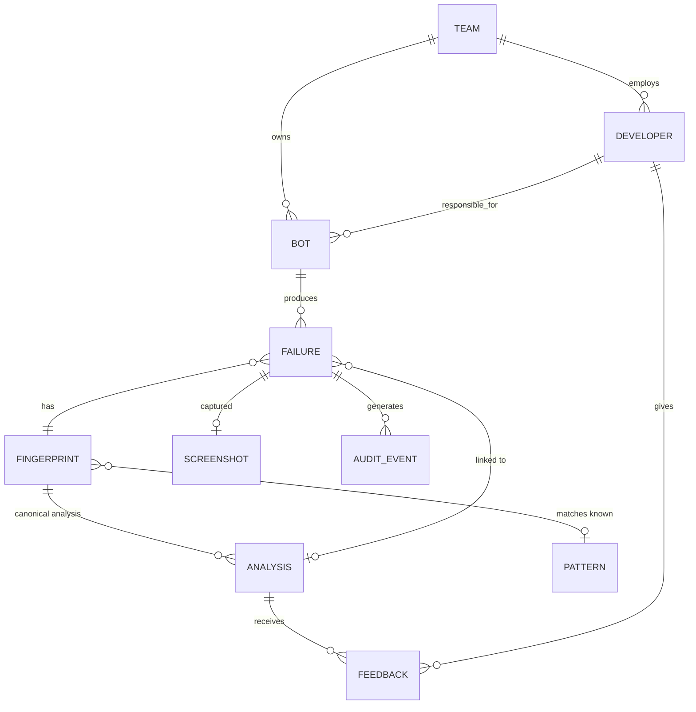

# Eagle Eyes — Data Model

---

## 1. Entities



| Entity | Role |
|---|---|
| `team` | Authorization boundary. Owns bots. |
| `developer` | SSO identity. Team member. Receives notifications. |
| `bot` | An automation. Has a responsible developer and a code location. |
| `failure` | One occurrence, with the paths every input came from. The high-volume table. |
| `fingerprint` | Dedup key. One row per distinct normalized failure signature. |
| `analysis` | A model-produced (or template) diagnosis, attached to a fingerprint. |
| `screenshot` | Image metadata + UNC path. Never image bytes, and in Mode 0 never a copy either. |
| `pattern` | A known failure type with a canned response. No model call. |
| `feedback` | Developer verdict on an analysis. Ground truth. |
| `audit_event` | Append-only access record. |
| `scan_watermark` | Which files the scanner has already processed. Makes restarts and re-scans safe. |

**The central relationship: analyses attach to fingerprints, not to failures.** That is what makes
dedup work. Five hundred failures sharing a fingerprint share one analysis and cost one model call.

**Two classifications, deliberately not one.** `analysis.path` records *how the answer was reached*
-- dedup, template, text, vision, fallback, skipped -- which is the cost story. `analysis.severity`
and `analysis.failure_type` record *what kind of failure it was* and *how much it matters*, which is
what a manager filters and sorts by. They answer different questions and a single column would
answer neither. All four taxonomy columns are nullable: an analysis stored before they existed, a
template answer, or a model that omitted one is NULL there, and NULL means nobody classified it
rather than that it is unimportant.

---

## 2. Fingerprint scheme

### 2.0 A dependency worth removing

Everything in §2.3 below — the normalization regexes, the 4-digit integer heuristic, the
"this is a guess, tune it in Phase 1" caveats — exists for one reason: we are reverse-engineering
structure out of iBot's free-text log.

**iBot is in-house.** If it emits the exception type, stack frames, activity name and code location
as a structured JSON sidecar (`ARCHITECTURE.md` §3), the fingerprint reads fields instead of parsing
prose, and this entire class of fragility disappears. Dedup is the system's primary cost control and
its primary silent-failure risk; making it depend on regexes over log text when the tool writing
that text is ours is a choice, not a constraint.

A JSON column on `failure` can receive that metadata when it exists. Build §2.3's text path now
because it is unblocked, but **treat structured emission as the target state**, and prefer the
structured fields whenever they are present.

### 2.1 Inputs

The fingerprint hashes a normalized tuple of:

1. **Exception type**, fully qualified — **the innermost one**. .NET wraps: iBot's retry scope reports
   `iBot.Core.ActivityException ---> System.Runtime.InteropServices.COMException`. Unwrap the
   `--->` chain and fingerprint on the *last* type, not the first (§2.2a)
2. **Normalized error message** — first 200 chars after normalization
3. **Top 5 stack frames**, each reduced to `module.function` — **line numbers dropped**
4. **Code location** — `repo + file path + enclosing function` — **not line number**

### 2.2 Deliberately excluded

| Excluded | Why |
|---|---|
| `bot_id` | The point is to collapse the same failure across bots. Included would defeat the primary cost control. |
| Timestamps | Every occurrence differs. |
| Run / job / correlation IDs | Per-execution noise. |
| Line numbers | A comment added above shifts every line; the failure is unchanged. |
| Machine / VM name | Same failure on a different bot VM is the same failure. Stored on the row for ops triage, never in the hash. |
| Screenshot content | Images of the same failure differ pixel-wise (cursor, clock, window position). Perceptual hashing was considered and rejected: it adds a failure mode without improving a hit rate that text already captures well. |

### 2.2a Unwrap the exception chain first

Realistic iBot logs (`fixtures/samples/`) showed that retry-wrapped failures report an outer type
that says nothing about the cause:

```
iBot.Core.ActivityException: Activity 'OpenRemittanceWorkbook' failed after 2 attempts.
   ---> System.Runtime.InteropServices.COMException (0x800A03EC): Microsoft Excel is waiting …
   --- End of inner exception stack trace ---
```

Fingerprinting on the outer type makes **every retry-wrapped failure in the estate the same
exception type**. An Excel COM hang and a locked-file `IOException` both become
`iBot.Core.ActivityException`, differing only by whatever survives in the message. Since iBot wraps
anything inside a `RetryScope` — which is most activities that touch a UI or a file — this would
have flattened a large fraction of all failures into one bucket.

**Rule: split on ` ---> `, take the last segment, and use that type.** Keep the outer type as a
separate stored field; it is useful context for the analysis prompt, but it is not identity.

Two details that follow from real .NET output:

- `--- End of inner exception stack trace ---` separates the inner frames from the outer ones. The
  frames *above* that marker are the ones near the actual fault, so prefer them when selecting the
  top five.
- Chains can nest more than two deep. Split on every ` ---> `, not just the first.

### 2.3 Normalization rules, in order

| Pattern | Replacement |
|---|---|
| **Selenium `(Session info: …)` trailer** — appended to every WebDriver exception | **dropped entirely** |
| **Dotted version strings** `128.0.6613.120` — before any integer rule | `<VER>` |
| **Pixel coordinates** `at point (642, 318)` | `at point (<X>,<Y>)` |
| ISO-8601 timestamps, epoch millis | `<TS>` |
| UUIDs / GUIDs | `<UUID>` |
| Hex runs ≥ 8 chars | `<HEX>` |
| `0x…` **memory addresses only** — bare, in stack frames | `<ADDR>` |
| `0x…` **HRESULTs** — inside parentheses after an exception name, e.g. `COMException (0x800A03EC)` | **kept, never normalized** (see below) |
| IPv4 / IPv6 + port | `<IP>` |
| Windows, UNC, POSIX paths | `<PATH>/basename` — basename kept |
| Integers ≥ 4 digits, **including when glued to a unit suffix** — `(?<!\d)\d{4,}(?!\d)`, *not* `\b\d{4,}\b` | `<NUM>` |
| Currency amounts | `<AMT>` |
| Quoted literals > 24 chars | `<STR>` |
| RPA selectors: dynamic `idx`/`tableRow` attrs | attribute dropped, rest kept |
| **Line endings — normalize CRLF → LF before anything else** | — |
| Whitespace runs | single space |
| Case | lowercased *after* all above |

**Drop the Selenium session trailer, or a Chrome update resets the whole cache.**

Every `OpenQA.Selenium.*` exception message carries a trailer naming the browser build:

```
stale element reference: element is not attached to the page document
  (Session info: chrome=128.0.6613.120)
```

Chrome auto-updates roughly every four weeks. Without this rule, **the morning after a rollout every
fingerprint in the estate changes at once** — the dedup cache is cold for every bot simultaneously,
and it happens again every month, forever. Measured against the cost model, a cold cache is **3.3x**
the warm cost: at 2,000 failures/day, $16.63 becomes $55.43 per day until it re-warms.

It would also be invisible. The analyses stay correct; only the bill moves. The `dedup_hit_rate`
alert (`COST_MODEL.md` §9) is what would eventually catch it, which is precisely why that alert is
the highest-value one in the list.

The same applies to any dotted version string, and to Selenium's session GUIDs and ChromeDriver port
numbers elsewhere in the log. **Normalize versions before the integer rule** — otherwise
`(?<!\d)\d{4,}(?!\d)` half-mangles `128.0.6613.120` into `128.0.<NUM>.120`, which still differs
between builds and is now unreadable as well.

**Normalize pixel coordinates.** `is not clickable at point (642, 318)` varies with window size and
page layout, so the same overlay bug on two differently-sized screens fingerprints differently. The
coordinates carry no diagnostic value the screenshot does not carry better — the identity of the
intercepting element, which Selenium also reports, is the part worth keeping.

**Never normalize an HRESULT.** The blanket rule `0x[0-9A-Fa-f]+ → <ADDR>` looks harmless and
destroys the single most diagnostic token in a COM failure. `COMException (0x800A03EC)` (Excel busy
with an OLE action) and `COMException (0x80010105)` (the server threw an exception) are different
faults with different fixes, and the rule collapses them into one fingerprint — verified against
`fixtures/samples/log_B_excel_com_timeout.log`.

COM failures are common in RPA, because RPA drives Office and legacy desktop applications through
exactly this interface. Match memory addresses narrowly (bare `0x…` in a stack frame) and leave
anything in `ExceptionName (0x…)` position alone.

**Read files with universal newlines.** iBot writes CRLF. `text.split("\n")` leaves a stranded `\r`
on every line, and a regex capturing to end-of-line captures it too — so the message that gets hashed
is `"...boom\r"`, not `"...boom"`. The whitespace rule happens to mask this inside a string, but the
exception *type* and any field captured before whitespace collapsing carry the CR into the hash. The
same failure read on two platforms then fingerprints differently. Open with `newline=None` (Python's
default for text mode) or strip explicitly; do not rely on the whitespace rule to save you.

**Use lookarounds, not `\b`, for the integer rule.** There is no word boundary between a digit and a
letter, so `\b\d{4,}\b` silently fails to match `15000ms`, `30000ms`, `4096KB` — any number glued to
a unit. RPA logs are full of these: almost every timeout is written that way.

This was caught by running the fingerprint over the synthetic estate
(`tools/make_fixtures.py`). A 200-failure incident spike that should have collapsed to **one**
fingerprint fragmented into **four** — one per distinct timeout value — because the four `...ms`
values never normalized. Measured across the 244 synthetic failures: **23 distinct fingerprints
before the fix, 14 after** — a dedup rate of 90.6% rising to 94.3%, with the spike collapsing to
exactly one.

It is worth dwelling on how this would have failed in production: silently, and worst precisely when
it mattered most. Timeouts are among the commonest RPA failures and the likeliest to arrive in a
spike, so the cost control would have degraded hardest under exactly the load it exists to handle,
with nothing in the system reporting a fault. **Every normalization rule needs a test that asserts a
known-identical set of failures collapses to one fingerprint.**

**Integers below 4 digits are kept on purpose.** `index 3` and `index 40` are plausibly different
failures; `order 100294` and `order 100295` are the same failure on different records. The 4-digit
cut is the crude line between "an index or count that matters" and "an identifier that does not".
This threshold is a guess and should be re-tuned against real logs in Phase 1 — it is exactly the
kind of parameter that looks fine in testing and is wrong in production.

Path basenames are kept because `config.xml not found` and `invoice.xlsx not found` are genuinely
different problems, while the directory they sat in usually is not.

### 2.4 Hash

```
fingerprint = sha256(
    "v1"                         # algorithm version — see below
    + "\x1f" + exception_type
    + "\x1f" + normalized_message[:200]
    + "\x1f" + "\x1e".join(top_5_frames)
    + "\x1f" + repo + ":" + file_path + ":" + function_name
)
```

`\x1f` / `\x1e` as separators so a value containing the separator cannot forge a collision.

### 2.5 Versioning — the thing most likely to be forgotten

`fingerprint_version` is stored on every row and is part of the hash input. When the normalization
rules change, the version increments and old fingerprints stop matching new ones.

This matters more than it sounds. Without it, a tweak to a normalization rule silently splits the
dedup namespace: hit rate collapses, cost spikes, and nothing in the system says why. With it, the
change is visible, the old analyses remain queryable, and the `dedup_hit_rate` alert
(`COST_MODEL.md` §9) fires against a known cause.

Dedup only matches within the same `fingerprint_version`.

### 2.6 Reuse eligibility

A fingerprint match is **necessary but not sufficient**. An existing analysis is reused only if:

1. Fingerprint matches **and** `fingerprint_version` matches, **and**
2. Analysis is younger than `ANALYSIS_REUSE_TTL` (default **30 days**), **and**
3. The bot's code file is unchanged — `code_mtime` matches, **and**
4. The analysis was not marked `wrong` by developer feedback

**Condition 3 is the one that protects correctness.** If the code changed, the previous suggested
fix may now be actively misleading — pointing a developer at a line that no longer exists, or
recommending a change already made. A dedup system that ignores code version saves money by
serving wrong answers.

There is no version control here, so `code_mtime` is the best available proxy (`ARCHITECTURE.md`
§4.5). It is weaker than a commit SHA in one specific way: **it detects that the file changed, never
which version the bot was actually running.** A failure analysed today may be reasoning about code
edited after it occurred. That case is flagged `code_possibly_stale` with a capped confidence rather
than hidden.

**Condition 4 closes the feedback loop.** An analysis developers marked wrong should not be served
to the next five hundred failures. Feedback is not just future training data; it invalidates cache
today. This is the cheapest quality mechanism in the system.

### 2.7 Collision risk

Over-normalization is the real risk, not hash collision. Two genuinely different failures that
normalize identically produce a wrong reused analysis — a silent correctness failure, exactly the
"confident wrong answer" the kit warns about.

Mitigations:
- Code location in the hash means different call sites never collide, even with identical messages
- Keeping small integers and path basenames preserves the distinctions that usually matter
- Developer feedback marking an analysis `wrong` invalidates reuse for that fingerprint
- **Phase 1 must sample:** periodically take deduped failures and analyse them independently, then
  compare. This measures the false-merge rate instead of assuming it is zero. Without this
  measurement we do not actually know the fingerprint is correct — we only know it is cheap.

---

## 3. Retention

| Entity | Retention | Trigger |
|---|---|---|
| `screenshot` (Mode 0) | **n/a — never copied** | Nothing to delete; the file stays on the VM share |
| `screenshot` derivative (Modes 1–2) | 7 days | Retention job |
| `scan_watermark` | 180 days | Retention job (keeps re-scan protection well past any backlog) |
| HTML reports on the share | 90 days | Retention job |
| `failure.log_sanitized` | 90 days | Retention job (nulls column, keeps row) |
| `failure.code_snapshot` | 90 days | Retention job |
| `failure` (row, metadata) | 24 months | Retention job |
| `analysis` | 12 months | Retention job |
| `fingerprint` | 24 months | Retention job |
| `feedback` | 24 months | — |
| `audit_event` | 7 years | Never deleted by the app |
| `pattern` | Indefinite | Curated |

**Content is nulled before rows are deleted.** A failure row keeps its fingerprint and timestamps
for trend analysis long after its log text is gone. Metrics survive; PII does not.

The retention job is idempotent, batched, and safe to re-run — it selects by `expires_at <= now()`
and processes in chunks so a large backlog cannot lock the table.

---

## 4. Schema (SQLite DDL)

SQLite, not Postgres: one host, one writer, tens of thousands of rows a year (§6). No server, no
backup agent, no DBA. The schema is written to port to Postgres for the Phase 3 service — §8 lists
what changes.

Run with `PRAGMA foreign_keys = ON;` on every connection. SQLite does not enforce foreign keys by
default, and a schema full of unenforced `REFERENCES` clauses is worse than none.

```sql
PRAGMA journal_mode = WAL;
PRAGMA foreign_keys = ON;

-- ---------- organisation ----------

CREATE TABLE team (
    id          INTEGER PRIMARY KEY,
    name        TEXT NOT NULL UNIQUE,
    sso_group   TEXT,
    created_at  TEXT NOT NULL DEFAULT (datetime('now'))
);

CREATE TABLE developer (
    id           INTEGER PRIMARY KEY,
    email        TEXT NOT NULL UNIQUE,
    display_name TEXT NOT NULL,
    team_id      INTEGER NOT NULL REFERENCES team(id),
    is_active    INTEGER NOT NULL DEFAULT 1 CHECK (is_active IN (0,1)),
    created_at   TEXT NOT NULL DEFAULT (datetime('now'))
);

-- service_line and bot_number come from the share path, not from log content.
CREATE TABLE bot (
    id            INTEGER PRIMARY KEY,
    service_line  TEXT NOT NULL,
    bot_number    TEXT NOT NULL,
    name          TEXT,
    team_id       INTEGER REFERENCES team(id),
    owner_dev_id  INTEGER REFERENCES developer(id),
    code_path     TEXT,                    -- resolved file in the shared code folder
    is_active     INTEGER NOT NULL DEFAULT 1 CHECK (is_active IN (0,1)),
    created_at    TEXT NOT NULL DEFAULT (datetime('now')),
    UNIQUE (service_line, bot_number)
);

-- ---------- known patterns ----------

CREATE TABLE pattern (
    id                INTEGER PRIMARY KEY,
    name              TEXT NOT NULL UNIQUE,
    match_rule        TEXT NOT NULL,       -- JSON
    response_template TEXT NOT NULL,
    severity          TEXT NOT NULL CHECK (severity IN ('low','medium','high','critical')),
    is_active         INTEGER NOT NULL DEFAULT 1 CHECK (is_active IN (0,1)),
    created_at        TEXT NOT NULL DEFAULT (datetime('now'))
);

-- ---------- dedup ----------

CREATE TABLE fingerprint (
    id                 INTEGER PRIMARY KEY,
    hash               TEXT NOT NULL CHECK (length(hash) = 64),
    version            INTEGER NOT NULL,
    exception_type     TEXT NOT NULL,
    normalized_message TEXT NOT NULL,
    code_location      TEXT NOT NULL,
    first_seen_at      TEXT NOT NULL DEFAULT (datetime('now')),
    last_seen_at       TEXT NOT NULL DEFAULT (datetime('now')),
    occurrence_count   INTEGER NOT NULL DEFAULT 1,
    pattern_id         INTEGER REFERENCES pattern(id),
    expires_at         TEXT NOT NULL,
    UNIQUE (hash, version)
);

-- NOTE: no separate index on (hash, version). The UNIQUE constraint above already
-- creates one, and SQLite uses it as a COVERING INDEX for the dedup lookup. A second
-- index on the same columns would be dead weight on every write. Verified — see §7.
CREATE INDEX idx_fingerprint_expiry ON fingerprint (expires_at);

-- ---------- analyses ----------

CREATE TABLE analysis (
    id                INTEGER PRIMARY KEY,
    fingerprint_id    INTEGER NOT NULL REFERENCES fingerprint(id),
    source_failure_id INTEGER,             -- provenance only; never dereferenced cross-team (§5)
    -- Every value analysis.Path_ can produce. It used to list four of the six,
    -- so an analysis that came back from the dedup store or was skipped for
    -- want of an exception could not be written down at all -- the two
    -- outcomes the design is proudest of. A test now derives this list from
    -- the enum rather than trusting the two to stay in step.
    path              TEXT NOT NULL CHECK (path IN
                          ('dedup','template','text','vision','fallback','skipped')),
    model_id          TEXT,
    code_mtime        TEXT,                -- pseudo-version; no VCS exists (ARCHITECTURE.md §4.5)
    root_cause        TEXT,
    suggested_fix     TEXT,
    confidence        REAL CHECK (confidence BETWEEN 0 AND 1),
    inputs_used       TEXT NOT NULL DEFAULT '[]',   -- JSON array
    -- The ROUTING class: what the router decided to DO about this failure. It
    -- was computed on every analysis and then thrown away, so "noise skipped"
    -- could only be approximated by path='skipped' -- which also means "no
    -- exception found in this log". One column makes the headline metric exact
    -- instead of nearly right.
    category          TEXT CHECK (category IS NULL OR category IN
                          ('noise','known_pattern','novel')),
    -- The failure taxonomy. A separate axis from `path` (how it was answered)
    -- and from `category` (what we did about it): this is what KIND of failure
    -- it was, which is what a manager filters and colours by. Nullable
    -- throughout, because analyses stored before these existed have none of
    -- them and an older row must still render.
    failure_type      TEXT CHECK (failure_type IS NULL OR failure_type IN
                          ('timeout','auth','network','data_validation','rate_limit',
                           'ssl','file_io','selector','logic_error','other')),
    severity          TEXT CHECK (severity IS NULL OR severity IN
                          ('low','medium','high','critical')),
    affected_function TEXT,
    recommendations   TEXT,
    is_superseded     INTEGER NOT NULL DEFAULT 0 CHECK (is_superseded IN (0,1)),
    tokens_in         INTEGER,
    tokens_out        INTEGER,
    cache_read_tokens INTEGER,
    image_tokens      INTEGER,
    cost_usd          REAL,
    latency_ms        INTEGER,
    created_at        TEXT NOT NULL DEFAULT (datetime('now')),
    expires_at        TEXT NOT NULL
);

CREATE INDEX idx_analysis_fingerprint ON analysis (fingerprint_id, created_at DESC)
    WHERE is_superseded = 0;
CREATE INDEX idx_analysis_expiry ON analysis (expires_at);

-- ---------- failures ----------

CREATE TABLE failure (
    id                   INTEGER PRIMARY KEY,
    bot_id               INTEGER NOT NULL REFERENCES bot(id),
    fingerprint_id       INTEGER NOT NULL REFERENCES fingerprint(id),
    analysis_id          INTEGER REFERENCES analysis(id),
    occurred_at          TEXT NOT NULL,
    ingested_at          TEXT NOT NULL DEFAULT (datetime('now')),
    status               TEXT NOT NULL DEFAULT 'pending'
        CHECK (status IN ('pending','deduped','analyzing','analyzed','failed','suppressed')),
    was_deduped          INTEGER NOT NULL DEFAULT 0 CHECK (was_deduped IN (0,1)),

    -- provenance: exactly where each input came from
    log_path             TEXT NOT NULL,     -- UNC path on the VM share
    screenshot_path      TEXT,              -- UNC path; NOT copied in Mode 0
    code_path            TEXT,
    code_mtime           TEXT,
    code_possibly_stale  INTEGER NOT NULL DEFAULT 0 CHECK (code_possibly_stale IN (0,1)),
    -- 'log_path' is the normal case: the log names the screenshot file (ARCHITECTURE 4.4).
    -- 'timestamp' is the fallback when no capture line exists; 'none' means we refused to guess.
    -- 'uploaded' means a person submitted the image alongside the log through the
    -- web UI. There is no sibling directory and no capture line to check it
    -- against, so it is whatever they attached -- recorded as its own method
    -- rather than borrowed from 'log_path', which would claim the log named it.
    pairing_method       TEXT CHECK (pairing_method IN
                             ('log_path','timestamp','none','uploaded')),

    log_sanitized        TEXT,              -- nulled at 90 days
    code_snapshot        TEXT,              -- nulled at 90 days
    -- Remediation state, which is a different question from `status` above --
    -- that one tracks the PIPELINE (did we analyse this yet), this one tracks
    -- the DEVELOPER (have they done anything about it). The POC kit kept this
    -- in localStorage: per-browser, invisible to a manager, and outside every
    -- access rule. Here it is a column, so it is scoped by `bot` like
    -- everything else and a manager can see it.
    --
    -- Counted per distinct FINGERPRINT rather than per row: a 203-failure
    -- spike is one problem, and "203 pending" is a number nobody can act on.
    fix_status           TEXT NOT NULL DEFAULT 'pending'
        CHECK (fix_status IN ('pending','reviewed','fixed')),
    correlation_id       TEXT NOT NULL,
    content_expires_at   TEXT NOT NULL,
    expires_at           TEXT NOT NULL
);

-- The scanner is restartable and re-reads folders; this makes a re-scan a no-op.
CREATE UNIQUE INDEX idx_failure_idempotency ON failure (log_path);
CREATE INDEX idx_failure_bot_time     ON failure (bot_id, occurred_at DESC);
CREATE INDEX idx_failure_fingerprint  ON failure (fingerprint_id, occurred_at DESC);
CREATE INDEX idx_failure_pending      ON failure (status) WHERE status IN ('pending','analyzing');
CREATE INDEX idx_failure_feed         ON failure (occurred_at DESC);
CREATE INDEX idx_failure_content_expiry ON failure (content_expires_at)
    WHERE log_sanitized IS NOT NULL;

-- ---------- screenshots (metadata only; no image bytes, no copy in Mode 0) ----------

CREATE TABLE screenshot (
    id              INTEGER PRIMARY KEY,
    failure_id      INTEGER NOT NULL UNIQUE REFERENCES failure(id) ON DELETE CASCADE,
    unc_path        TEXT NOT NULL,
    -- Only the modes that exist. 1 (crop) and 2 (crop + OCR-redact) are
    -- designed in SECURITY.md 3.3 and unimplemented; a row claiming one
    -- would assert a protection nothing applied. See analysis.SCREENSHOT_MODES.
    processing_mode INTEGER NOT NULL CHECK (processing_mode IN (0, 3)),
    derivative_path TEXT,                  -- Modes 1-2 only; always NULL today
    was_cropped     INTEGER NOT NULL DEFAULT 0 CHECK (was_cropped IN (0,1)),
    was_redacted    INTEGER NOT NULL DEFAULT 0 CHECK (was_redacted IN (0,1)),
    sent_to_model   INTEGER NOT NULL DEFAULT 0 CHECK (sent_to_model IN (0,1)),
    width_px        INTEGER,
    height_px       INTEGER,
    bytes           INTEGER,
    captured_at     TEXT,
    expires_at      TEXT,                  -- derivative only; NULL when nothing was copied
    deleted_at      TEXT
);

CREATE INDEX idx_screenshot_derivative_expiry ON screenshot (expires_at)
    WHERE derivative_path IS NOT NULL AND deleted_at IS NULL;

-- ---------- feedback ----------

CREATE TABLE feedback (
    id           INTEGER PRIMARY KEY,
    analysis_id  INTEGER NOT NULL REFERENCES analysis(id),
    failure_id   INTEGER NOT NULL REFERENCES failure(id),
    developer_id INTEGER NOT NULL REFERENCES developer(id),
    verdict      TEXT NOT NULL CHECK (verdict IN ('correct','partial','wrong')),
    comment      TEXT,
    created_at   TEXT NOT NULL DEFAULT (datetime('now')),
    UNIQUE (analysis_id, developer_id)
);

CREATE INDEX idx_feedback_analysis ON feedback (analysis_id);
CREATE INDEX idx_feedback_wrong    ON feedback (analysis_id) WHERE verdict = 'wrong';

-- ---------- scanner watermark ----------

CREATE TABLE scan_watermark (
    file_path     TEXT PRIMARY KEY,        -- UNC path of a processed file
    file_mtime    TEXT NOT NULL,
    file_size     INTEGER NOT NULL,
    processed_at  TEXT NOT NULL DEFAULT (datetime('now')),
    outcome       TEXT NOT NULL CHECK (outcome IN ('ingested','skipped','error'))
);

CREATE INDEX idx_watermark_processed ON scan_watermark (processed_at DESC);

-- ---------- audit ----------

CREATE TABLE audit_event (
    id             INTEGER PRIMARY KEY,
    actor          TEXT NOT NULL,
    actor_role     TEXT NOT NULL,
    action         TEXT NOT NULL,
    resource_type  TEXT NOT NULL,
    resource_id    TEXT NOT NULL,
    outcome        TEXT NOT NULL CHECK (outcome IN ('allow','deny')),
    correlation_id TEXT,
    occurred_at    TEXT NOT NULL DEFAULT (datetime('now'))
);

CREATE INDEX idx_audit_actor    ON audit_event (actor, occurred_at DESC);
CREATE INDEX idx_audit_resource ON audit_event (resource_type, resource_id, occurred_at DESC);
CREATE INDEX idx_audit_denials  ON audit_event (occurred_at DESC) WHERE outcome = 'deny';

-- SQLite has no GRANT/REVOKE, so append-only is enforced by trigger instead.
CREATE TRIGGER audit_no_update BEFORE UPDATE ON audit_event
BEGIN SELECT RAISE(ABORT, 'audit_event is append-only'); END;

CREATE TRIGGER audit_no_delete BEFORE DELETE ON audit_event
BEGIN SELECT RAISE(ABORT, 'audit_event is append-only'); END;

-- ---------- notification suppression ----------

CREATE TABLE notification_state (
    id                INTEGER PRIMARY KEY,
    fingerprint_id    INTEGER NOT NULL REFERENCES fingerprint(id),
    developer_id      INTEGER NOT NULL REFERENCES developer(id),
    first_notified_at TEXT NOT NULL DEFAULT (datetime('now')),
    last_notified_at  TEXT NOT NULL DEFAULT (datetime('now')),
    suppressed_count  INTEGER NOT NULL DEFAULT 0,
    UNIQUE (fingerprint_id, developer_id)
);

-- ---------- accounts ----------
--
-- `developer` is a person a bot belongs to. `account` is a person who can sign
-- in. They are deliberately separate: a manager who owns no bots still needs a
-- login, and a developer who never uses the web UI still needs to receive
-- notifications and own failures.
--
-- Nothing is granted at registration. An account starts `requested` and can
-- sign in immediately -- and see nothing -- until an admin approves it with a
-- role. Sign-in and authorisation are different questions, and conflating them
-- is how "pending" accounts end up with read access nobody granted.

CREATE TABLE account (
    id             INTEGER PRIMARY KEY,
    email          TEXT NOT NULL UNIQUE,
    display_name   TEXT NOT NULL,
    -- scrypt. `salt` and `password_hash` are hex; `params` records n/r/p so a
    -- future cost increase can re-hash on next sign-in instead of locking
    -- everyone out.
    password_hash  TEXT NOT NULL,
    salt           TEXT NOT NULL,
    params         TEXT NOT NULL,
    status         TEXT NOT NULL DEFAULT 'requested'
                   CHECK (status IN ('requested','approved','suspended','revoked')),
    role           TEXT NOT NULL DEFAULT 'user'
                   CHECK (role IN ('admin','manager','user')),
    developer_id   INTEGER REFERENCES developer(id),
    approved_by    TEXT,
    approved_at    TEXT,
    created_at     TEXT NOT NULL DEFAULT (datetime('now')),
    last_login_at  TEXT,
    failed_logins  INTEGER NOT NULL DEFAULT 0,
    locked_until   TEXT
);

CREATE INDEX idx_account_status ON account (status, role);

-- A manager's scope: the teams they may see failures for. A row here is
-- meaningless for an admin (who sees everything) and for a user (who sees only
-- their own), so the application never reads it for those roles.
CREATE TABLE account_scope (
    account_id  INTEGER NOT NULL REFERENCES account(id) ON DELETE CASCADE,
    team_id     INTEGER NOT NULL REFERENCES team(id),
    granted_by  TEXT NOT NULL,
    granted_at  TEXT NOT NULL DEFAULT (datetime('now')),
    PRIMARY KEY (account_id, team_id)
);

-- Server-side sessions. The cookie carries an id and a signature; everything
-- that decides access is read from here on each request, so revoking an account
-- takes effect on its next request rather than whenever its cookie expires.
CREATE TABLE session (
    id           TEXT PRIMARY KEY,          -- 256 bits of urandom, hex
    account_id   INTEGER NOT NULL REFERENCES account(id) ON DELETE CASCADE,
    created_at   TEXT NOT NULL DEFAULT (datetime('now')),
    expires_at   TEXT NOT NULL,
    last_seen_at TEXT NOT NULL DEFAULT (datetime('now')),
    user_agent   TEXT,
    revoked_at   TEXT
);

CREATE INDEX idx_session_account ON session (account_id) WHERE revoked_at IS NULL;
CREATE INDEX idx_session_expiry  ON session (expires_at);

-- ---------- scheduled scans ----------
--
-- A schedule reads a path ON THE MACHINE RUNNING THIS PROCESS. That is the
-- whole semantic, and it is why `runtime.in_container()` matters: a hosted
-- instance has no desktop and no share, so a schedule there is a definition
-- waiting for somewhere to run, not a job that is quietly working.
-- `last_outcome` records which of those actually happened.

CREATE TABLE scan_schedule (
    id            INTEGER PRIMARY KEY,
    account_id    INTEGER NOT NULL REFERENCES account(id) ON DELETE CASCADE,
    name          TEXT NOT NULL,
    target_path   TEXT NOT NULL,
    share_root    TEXT NOT NULL,
    code_root     TEXT NOT NULL,
    every_minutes INTEGER NOT NULL CHECK (every_minutes >= 5),
    enabled       INTEGER NOT NULL DEFAULT 1 CHECK (enabled IN (0,1)),
    created_at    TEXT NOT NULL DEFAULT (datetime('now')),
    last_run_at   TEXT,
    last_outcome  TEXT,
    last_found    INTEGER NOT NULL DEFAULT 0,
    last_analysed INTEGER NOT NULL DEFAULT 0,
    UNIQUE (account_id, name)
);

CREATE INDEX idx_schedule_due ON scan_schedule (enabled, last_run_at);
```

## 5. The cross-team reuse constraint

`SECURITY.md` §10.4 commits to a mitigation that this schema must enforce: when Team B's failure
reuses an analysis generated from Team A's failure, Team B sees the **diagnosis** and never the
source data.

Mechanically:

- `analysis.root_cause` and `analysis.suggested_fix` are reusable across teams.
- `analysis.source_failure_id` points at Team A's failure. It exists for provenance and **must
  never be dereferenced for a caller who is not authorized on that failure.**
- The screenshot and log a developer sees are always reached through **their own** `failure` row —
  `failure.log_sanitized` and `screenshot.failure_id` — never through the analysis.

The repository layer must expose no method that walks `analysis → source_failure → screenshot`.
This is the single most likely way to accidentally build a cross-team data leak into a system that
otherwise authorizes correctly, because the join is natural and the intent is innocent.

Tests must assert it explicitly (`SECURITY.md` §6.4).

---

## 6. Volume estimate

At 2,000 failures/day — the top of the projected range:

| Table | Rows/year | Notes |
|---|---|---|
| `failure` | ~730K | Content nulled at 90 days; rows kept 24 months |
| `fingerprint` | ~20–60K | Grows far slower than failures — that is the dedup working |
| `analysis` | ~60–150K | One per unique fingerprint per code version |
| `screenshot` | ~730K rows | **Metadata only — no image bytes stored. Under 100 MB.** |
| `scan_watermark` | ~1.5M | One row per file seen; pruned at 180 days |
| `audit_event` | ~3–5M | The largest table. Partition by month. |

Comfortably a single SQLite file — on the order of a few GB a year at the top of the range, most of
it `audit_event` and `scan_watermark`. Well inside what SQLite handles with one writer.

Not storing image bytes is what keeps this small. The previous design projected ~150 GB of S3 for
screenshots; Mode 0 stores none, because the files already exist somewhere we can read.

---

## 7. Verified index and type behaviour

Both of the following were checked by executing the schema, not by reasoning about it.

### 7.1 The dedup index already exists — do not add a second one

`UNIQUE (hash, version)` creates an index. Adding `CREATE INDEX ... ON fingerprint (hash, version)`
on top of it produces a duplicate that SQLite never chooses, while still costing a write on every
insert. Confirmed on 5,000 rows:

```
EXPLAIN QUERY PLAN SELECT id FROM fingerprint WHERE hash=? AND version=1;
--> SEARCH fingerprint USING COVERING INDEX sqlite_autoindex_fingerprint_1 (hash=? AND version=?)
```

"Covering" means the lookup is satisfied from the index alone without touching the table — the best
case for the hottest query in the system. The earlier draft carried the redundant index; it has been
removed.

**Assert the plan in the test suite.** One test that runs `EXPLAIN QUERY PLAN` on the dedup lookup
and asserts a `SEARCH ... USING ... INDEX` (never `SCAN`) is the cheapest possible guard against a
regression whose only symptom would be an unexplained rise in cost and latency.

### 7.2 Keep `hash` as TEXT when this ports to Postgres

A 64-character hex digest invites `CHAR(64)`. In Postgres that is a trap, and it breaks exactly the
index above.

`CHAR(n)` is `bpchar`, a distinct type from `text`, so the index is built with `bpchar_ops`. When an
application binds an ordinary string parameter — which every driver and ORM does — Postgres receives
`text`, cannot match the operator class, and casts the *column* instead. Verified on PostgreSQL 16
with 20,000 rows:

```
-- hash CHAR(64), parameter bound as text:
Seq Scan on fingerprint
  Filter: ((version = 1) AND ((hash)::text = '...'::text))

-- hash TEXT, same query:
Index Scan using idx_fingerprint_lookup
  Index Cond: ((hash = '...'::text) AND (version = 1))
```

Silent, correct, and only expensive at scale — a sequential scan over a growing fingerprint table on
the hot path, with nothing in the application reporting a problem. `CHAR(n)` also blank-pads to
width, so a value compares equal to itself plus trailing spaces.

SQLite has no `bpchar`, so this does not bite today. It is recorded because the Phase 3 port is
where it would, and the length `CHECK` gives the same guarantee without the type.

---

## 8. Porting to Postgres (Phase 3)

The Phase 3 service needs concurrent writers and multi-user access, which SQLite is not for. The
schema is written so the port is mechanical:

| SQLite | Postgres |
|---|---|
| `INTEGER PRIMARY KEY` | `BIGSERIAL PRIMARY KEY` |
| `TEXT` datetimes | `TIMESTAMPTZ` |
| `TEXT` holding JSON | `JSONB` |
| `TEXT` JSON arrays (`inputs_used`) | `TEXT[]` |
| `INTEGER` booleans + CHECK | `BOOLEAN` |
| `REAL` | `NUMERIC(10,6)` for money, `NUMERIC(3,2)` for confidence |
| Append-only triggers on `audit_event` | `REVOKE UPDATE, DELETE` |
| `correlation_id TEXT` | `UUID` |

Two things that do **not** carry over automatically:

- **Partial indexes** exist in both, with the same syntax — no change needed.
- **`REAL` for `cost_usd` is acceptable in SQLite and wrong in Postgres.** Use `NUMERIC` there;
  binary floating point accumulating a monthly spend figure will drift.

Partition `audit_event` by month at that point. It is the only table where retrofitting partitioning
would be painful, and at 2,000 failures/day it is by far the largest.
