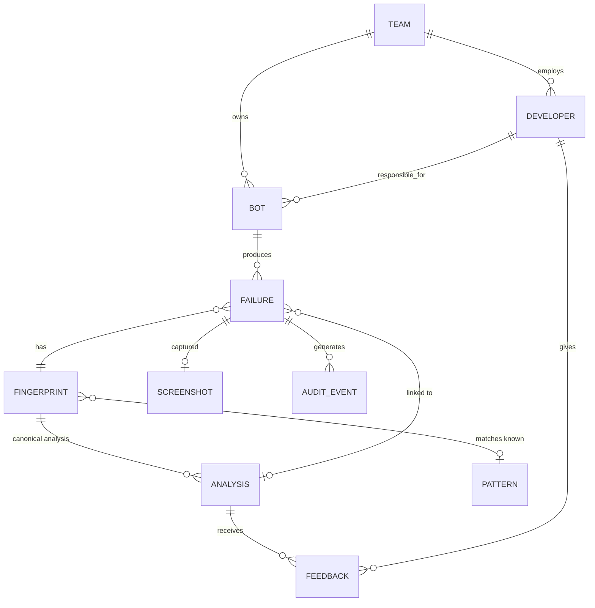

# Eagle Eyes — Data Model

---

## 1. Entities



| Entity | Role |
|---|---|
| `team` | Authorization boundary. Owns bots. |
| `developer` | SSO identity. Team member. Receives notifications. |
| `bot` | An automation. Has a responsible developer and a code location. |
| `failure` | One occurrence. The high-volume table. |
| `fingerprint` | Dedup key. One row per distinct normalized failure signature. |
| `analysis` | A model-produced (or template) diagnosis, attached to a fingerprint. |
| `screenshot` | Image metadata + S3 pointer. Never image bytes in the database. |
| `pattern` | A known failure type with a canned response. No model call. |
| `feedback` | Developer verdict on an analysis. Ground truth. |
| `audit_event` | Append-only access record. |

**The central relationship: analyses attach to fingerprints, not to failures.** That is what makes
dedup work. Five hundred failures sharing a fingerprint share one analysis and cost one model call.

---

## 2. Fingerprint scheme

### 2.0 A dependency worth removing

Everything in §2.3 below — the normalization regexes, the 4-digit integer heuristic, the
"this is a guess, tune it in Phase 1" caveats — exists for one reason: we are reverse-engineering
structure out of iBot's free-text log.

**iBot is in-house.** If it emits the exception type, stack frames, activity name and code location
as a structured JSON sidecar (`ARCHITECTURE.md` §3), the fingerprint reads fields instead of parsing
prose, and this entire class of fragility disappears. Dedup is the system's primary cost control and
its primary silent-failure risk; making it depend on regexes over log text when the tool writing
that text is ours is a choice, not a constraint.

The `failure.ibot_error` JSONB column exists to receive that metadata. Build §2.3's text path now
because it is unblocked, but **treat structured emission as the target state**, and prefer the
structured fields whenever they are present.

### 2.1 Inputs

The fingerprint hashes a normalized tuple of:

1. **Exception type**, fully qualified, as iBot reports it (e.g. `iBot.Core.ElementNotFoundException`)
2. **Normalized error message** — first 200 chars after normalization
3. **Top 5 stack frames**, each reduced to `module.function` — **line numbers dropped**
4. **Code location** — `repo + file path + enclosing function` — **not line number**

### 2.2 Deliberately excluded

| Excluded | Why |
|---|---|
| `bot_id` | The point is to collapse the same failure across bots. Included would defeat the primary cost control. |
| Timestamps | Every occurrence differs. |
| Run / job / correlation IDs | Per-execution noise. |
| Line numbers | A comment added above shifts every line; the failure is unchanged. |
| Machine / VM name | Same failure on a different bot VM is the same failure. Stored on the row for ops triage, never in the hash. |
| Screenshot content | Images of the same failure differ pixel-wise (cursor, clock, window position). Perceptual hashing was considered and rejected: it adds a failure mode without improving a hit rate that text already captures well. |

### 2.3 Normalization rules, in order

| Pattern | Replacement |
|---|---|
| ISO-8601 timestamps, epoch millis | `<TS>` |
| UUIDs / GUIDs | `<UUID>` |
| Hex runs ≥ 8 chars | `<HEX>` |
| `0x...` addresses | `<ADDR>` |
| IPv4 / IPv6 + port | `<IP>` |
| Windows, UNC, POSIX paths | `<PATH>/basename` — basename kept |
| Integers ≥ 4 digits | `<NUM>` |
| Currency amounts | `<AMT>` |
| Quoted literals > 24 chars | `<STR>` |
| RPA selectors: dynamic `idx`/`tableRow` attrs | attribute dropped, rest kept |
| Whitespace runs | single space |
| Case | lowercased *after* all above |

**Integers below 4 digits are kept on purpose.** `index 3` and `index 40` are plausibly different
failures; `order 100294` and `order 100295` are the same failure on different records. The 4-digit
cut is the crude line between "an index or count that matters" and "an identifier that does not".
This threshold is a guess and should be re-tuned against real logs in Phase 1 — it is exactly the
kind of parameter that looks fine in testing and is wrong in production.

Path basenames are kept because `config.xml not found` and `invoice.xlsx not found` are genuinely
different problems, while the directory they sat in usually is not.

### 2.4 Hash

```
fingerprint = sha256(
    "v1"                         # algorithm version — see below
    + "\x1f" + exception_type
    + "\x1f" + normalized_message[:200]
    + "\x1f" + "\x1e".join(top_5_frames)
    + "\x1f" + repo + ":" + file_path + ":" + function_name
)
```

`\x1f` / `\x1e` as separators so a value containing the separator cannot forge a collision.

### 2.5 Versioning — the thing most likely to be forgotten

`fingerprint_version` is stored on every row and is part of the hash input. When the normalization
rules change, the version increments and old fingerprints stop matching new ones.

This matters more than it sounds. Without it, a tweak to a normalization rule silently splits the
dedup namespace: hit rate collapses, cost spikes, and nothing in the system says why. With it, the
change is visible, the old analyses remain queryable, and the `dedup_hit_rate` alert
(`COST_MODEL.md` §9) fires against a known cause.

Dedup only matches within the same `fingerprint_version`.

### 2.6 Reuse eligibility

A fingerprint match is **necessary but not sufficient**. An existing analysis is reused only if:

1. Fingerprint matches **and** `fingerprint_version` matches, **and**
2. Analysis is younger than `ANALYSIS_REUSE_TTL` (default **30 days**), **and**
3. The bot's code at that location is unchanged — `code_commit_sha` matches, **and**
4. The analysis was not marked `wrong` by developer feedback

**Condition 3 is the one that protects correctness.** If the code changed, the previous suggested
fix may now be actively misleading — pointing a developer at a line that no longer exists, or
recommending a change already made. A dedup system that ignores code version saves money by
serving wrong answers.

**Condition 4 closes the feedback loop.** An analysis developers marked wrong should not be served
to the next five hundred failures. Feedback is not just future training data; it invalidates cache
today. This is the cheapest quality mechanism in the system.

### 2.7 Collision risk

Over-normalization is the real risk, not hash collision. Two genuinely different failures that
normalize identically produce a wrong reused analysis — a silent correctness failure, exactly the
"confident wrong answer" the kit warns about.

Mitigations:
- Code location in the hash means different call sites never collide, even with identical messages
- Keeping small integers and path basenames preserves the distinctions that usually matter
- Developer feedback marking an analysis `wrong` invalidates reuse for that fingerprint
- **Phase 1 must sample:** periodically take deduped failures and analyse them independently, then
  compare. This measures the false-merge rate instead of assuming it is zero. Without this
  measurement we do not actually know the fingerprint is correct — we only know it is cheap.

---

## 3. Retention

| Entity | Retention | Trigger |
|---|---|---|
| `screenshot` (raw, quarantine) | 24 hours | Lifecycle + explicit delete |
| `screenshot` (processed) | 30 days | Retention job |
| `failure.log_sanitized` | 90 days | Retention job (nulls column, keeps row) |
| `failure.code_snapshot` | 90 days | Retention job |
| `failure` (row, metadata) | 24 months | Retention job |
| `analysis` | 12 months | Retention job |
| `fingerprint` | 24 months | Retention job |
| `feedback` | 24 months | — |
| `audit_event` | 7 years | Never deleted by the app |
| `pattern` | Indefinite | Curated |

**Content is nulled before rows are deleted.** A failure row keeps its fingerprint and timestamps
for trend analysis long after its log text is gone. Metrics survive; PII does not.

The retention job is idempotent, batched, and safe to re-run — it selects by `expires_at <= now()`
and processes in chunks so a large backlog cannot lock the table.

---

## 4. Schema (PostgreSQL DDL)

```sql
-- ---------- organisation ----------

CREATE TABLE team (
    id              BIGSERIAL PRIMARY KEY,
    name            TEXT NOT NULL UNIQUE,
    sso_group       TEXT NOT NULL UNIQUE,
    created_at      TIMESTAMPTZ NOT NULL DEFAULT now()
);

CREATE TABLE developer (
    id              BIGSERIAL PRIMARY KEY,
    sso_subject     TEXT NOT NULL UNIQUE,
    email           TEXT NOT NULL UNIQUE,
    display_name    TEXT NOT NULL,
    team_id         BIGINT NOT NULL REFERENCES team(id),
    is_active       BOOLEAN NOT NULL DEFAULT TRUE,
    created_at      TIMESTAMPTZ NOT NULL DEFAULT now()
);

CREATE TABLE bot (
    id              BIGSERIAL PRIMARY KEY,
    external_id     TEXT NOT NULL,
    source_platform TEXT NOT NULL DEFAULT 'ibot' CHECK (source_platform = 'ibot'),
    name            TEXT NOT NULL,
    vm_hostname     TEXT,
    team_id         BIGINT NOT NULL REFERENCES team(id),
    owner_dev_id    BIGINT REFERENCES developer(id),
    repo_url        TEXT,
    is_active       BOOLEAN NOT NULL DEFAULT TRUE,
    created_at      TIMESTAMPTZ NOT NULL DEFAULT now(),
    UNIQUE (source_platform, external_id)
);
-- source_platform is retained with a single-value CHECK rather than dropped: iBot is the only
-- platform today, and a one-line constraint change is cheaper than a migration if that stops
-- being true. No adapter framework is built for it — see ARCHITECTURE.md §3.

-- ---------- known patterns ----------

CREATE TABLE pattern (
    id              BIGSERIAL PRIMARY KEY,
    name            TEXT NOT NULL UNIQUE,
    match_rule      JSONB NOT NULL,
    response_template TEXT NOT NULL,
    severity        TEXT NOT NULL CHECK (severity IN ('low','medium','high','critical')),
    is_active       BOOLEAN NOT NULL DEFAULT TRUE,
    created_at      TIMESTAMPTZ NOT NULL DEFAULT now()
);

-- ---------- dedup ----------

CREATE TABLE fingerprint (
    id                  BIGSERIAL PRIMARY KEY,
    hash                TEXT NOT NULL CHECK (char_length(hash) = 64),
    version             SMALLINT NOT NULL,
    exception_type      TEXT NOT NULL,
    normalized_message  TEXT NOT NULL,
    code_location       TEXT NOT NULL,
    first_seen_at       TIMESTAMPTZ NOT NULL DEFAULT now(),
    last_seen_at        TIMESTAMPTZ NOT NULL DEFAULT now(),
    occurrence_count    BIGINT NOT NULL DEFAULT 1,
    pattern_id          BIGINT REFERENCES pattern(id),
    expires_at          TIMESTAMPTZ NOT NULL,
    UNIQUE (hash, version)
);

-- The index dedup performance depends on. Covers the hot lookup path.
CREATE INDEX idx_fingerprint_lookup ON fingerprint (hash, version);
-- NOTE: hash is TEXT, not CHAR(64), deliberately. See §7.
CREATE INDEX idx_fingerprint_expiry ON fingerprint (expires_at);

-- ---------- analyses ----------

CREATE TABLE analysis (
    id                  BIGSERIAL PRIMARY KEY,
    fingerprint_id      BIGINT NOT NULL REFERENCES fingerprint(id),
    source_failure_id   BIGINT,               -- FK added after failure table
    path                TEXT NOT NULL
        CHECK (path IN ('template','text','vision','fallback')),
    model_id            TEXT,
    code_commit_sha     TEXT,                 -- reuse gate: §2.6 condition 3
    root_cause          TEXT,
    suggested_fix       TEXT,
    confidence          NUMERIC(3,2) CHECK (confidence BETWEEN 0 AND 1),
    inputs_used         TEXT[] NOT NULL DEFAULT '{}',
    is_superseded       BOOLEAN NOT NULL DEFAULT FALSE,
    tokens_in           INTEGER,
    tokens_out          INTEGER,
    cache_read_tokens   INTEGER,
    image_tokens        INTEGER,
    cost_usd            NUMERIC(10,6),
    latency_ms          INTEGER,
    created_at          TIMESTAMPTZ NOT NULL DEFAULT now(),
    expires_at          TIMESTAMPTZ NOT NULL
);

CREATE INDEX idx_analysis_fingerprint ON analysis (fingerprint_id, created_at DESC)
    WHERE is_superseded = FALSE;
CREATE INDEX idx_analysis_expiry ON analysis (expires_at);

-- ---------- failures ----------

CREATE TABLE failure (
    id                  BIGSERIAL PRIMARY KEY,
    bot_id              BIGINT NOT NULL REFERENCES bot(id),
    fingerprint_id      BIGINT NOT NULL REFERENCES fingerprint(id),
    analysis_id         BIGINT REFERENCES analysis(id),
    run_id              TEXT,
    occurred_at         TIMESTAMPTZ NOT NULL,
    ingested_at         TIMESTAMPTZ NOT NULL DEFAULT now(),
    status              TEXT NOT NULL DEFAULT 'pending'
        CHECK (status IN ('pending','deduped','analyzing','analyzed','failed','suppressed')),
    was_deduped         BOOLEAN NOT NULL DEFAULT FALSE,
    log_sanitized       TEXT,                 -- nulled at 90 days
    code_snapshot       TEXT,                 -- nulled at 90 days
    code_commit_sha     TEXT,
    severity            TEXT CHECK (severity IN ('low','medium','high','critical')),
    correlation_id      UUID NOT NULL,
    vm_hostname         TEXT,                 -- which VM produced it; ops triage, not authorization
    emitter_kind        TEXT CHECK (emitter_kind IN ('ibot_native','sidecar')),
    emitter_version     TEXT,                 -- for correlating bad data with an emitter release
    spool_delay_ms      BIGINT,               -- occurred_at -> ingested_at gap; detects VM backlog
    ibot_error          JSONB NOT NULL DEFAULT '{}',  -- structured metadata if iBot emits it
    platform_extras     JSONB NOT NULL DEFAULT '{}',
    content_expires_at  TIMESTAMPTZ NOT NULL,
    expires_at          TIMESTAMPTZ NOT NULL
);

ALTER TABLE analysis
    ADD CONSTRAINT fk_analysis_source_failure
    FOREIGN KEY (source_failure_id) REFERENCES failure(id);

-- Emitters deliver at-least-once and retry after network failures; this makes retries free.
CREATE UNIQUE INDEX idx_failure_idempotency ON failure (bot_id, run_id) WHERE run_id IS NOT NULL;
CREATE INDEX idx_failure_bot_time   ON failure (bot_id, occurred_at DESC);
CREATE INDEX idx_failure_fingerprint ON failure (fingerprint_id, occurred_at DESC);
CREATE INDEX idx_failure_status     ON failure (status) WHERE status IN ('pending','analyzing');
CREATE INDEX idx_failure_feed       ON failure (occurred_at DESC);
CREATE INDEX idx_failure_content_expiry ON failure (content_expires_at)
    WHERE log_sanitized IS NOT NULL;

-- ---------- screenshots ----------

CREATE TABLE screenshot (
    id                  BIGSERIAL PRIMARY KEY,
    failure_id          BIGINT NOT NULL UNIQUE REFERENCES failure(id) ON DELETE CASCADE,
    s3_bucket           TEXT NOT NULL,
    s3_key              TEXT NOT NULL,
    processing_mode     SMALLINT NOT NULL CHECK (processing_mode BETWEEN 0 AND 3),
    was_redacted        BOOLEAN NOT NULL DEFAULT FALSE,
    was_cropped         BOOLEAN NOT NULL DEFAULT FALSE,
    sent_to_model       BOOLEAN NOT NULL DEFAULT FALSE,
    width_px            INTEGER,
    height_px           INTEGER,
    bytes               BIGINT,
    captured_at         TIMESTAMPTZ,
    processed_at        TIMESTAMPTZ,
    expires_at          TIMESTAMPTZ NOT NULL,
    deleted_at          TIMESTAMPTZ
);

CREATE INDEX idx_screenshot_expiry ON screenshot (expires_at) WHERE deleted_at IS NULL;

-- ---------- feedback ----------

CREATE TABLE feedback (
    id              BIGSERIAL PRIMARY KEY,
    analysis_id     BIGINT NOT NULL REFERENCES analysis(id),
    failure_id      BIGINT NOT NULL REFERENCES failure(id),
    developer_id    BIGINT NOT NULL REFERENCES developer(id),
    verdict         TEXT NOT NULL CHECK (verdict IN ('correct','partial','wrong')),
    comment         TEXT,
    created_at      TIMESTAMPTZ NOT NULL DEFAULT now(),
    UNIQUE (analysis_id, developer_id)
);

CREATE INDEX idx_feedback_analysis ON feedback (analysis_id);
CREATE INDEX idx_feedback_wrong ON feedback (analysis_id) WHERE verdict = 'wrong';

-- ---------- audit ----------

CREATE TABLE audit_event (
    id              BIGSERIAL PRIMARY KEY,
    actor_sub       TEXT NOT NULL,
    actor_role      TEXT NOT NULL,
    action          TEXT NOT NULL,
    resource_type   TEXT NOT NULL,
    resource_id     TEXT NOT NULL,
    outcome         TEXT NOT NULL CHECK (outcome IN ('allow','deny')),
    source_ip       INET,
    correlation_id  UUID,
    occurred_at     TIMESTAMPTZ NOT NULL DEFAULT now()
);

CREATE INDEX idx_audit_actor    ON audit_event (actor_sub, occurred_at DESC);
CREATE INDEX idx_audit_resource ON audit_event (resource_type, resource_id, occurred_at DESC);
CREATE INDEX idx_audit_denials  ON audit_event (occurred_at DESC) WHERE outcome = 'deny';

REVOKE UPDATE, DELETE ON audit_event FROM PUBLIC;

-- ---------- notification suppression ----------

CREATE TABLE notification_state (
    id                  BIGSERIAL PRIMARY KEY,
    fingerprint_id      BIGINT NOT NULL REFERENCES fingerprint(id),
    developer_id        BIGINT NOT NULL REFERENCES developer(id),
    first_notified_at   TIMESTAMPTZ NOT NULL DEFAULT now(),
    last_notified_at    TIMESTAMPTZ NOT NULL DEFAULT now(),
    suppressed_count    INTEGER NOT NULL DEFAULT 0,
    UNIQUE (fingerprint_id, developer_id)
);
```

---

## 5. The cross-team reuse constraint

`SECURITY.md` §10.4 commits to a mitigation that this schema must enforce: when Team B's failure
reuses an analysis generated from Team A's failure, Team B sees the **diagnosis** and never the
source data.

Mechanically:

- `analysis.root_cause` and `analysis.suggested_fix` are reusable across teams.
- `analysis.source_failure_id` points at Team A's failure. It exists for provenance and **must
  never be dereferenced for a caller who is not authorized on that failure.**
- The screenshot and log a developer sees are always reached through **their own** `failure` row —
  `failure.log_sanitized` and `screenshot.failure_id` — never through the analysis.

The repository layer must expose no method that walks `analysis → source_failure → screenshot`.
This is the single most likely way to accidentally build a cross-team data leak into a system that
otherwise authorizes correctly, because the join is natural and the intent is innocent.

Tests must assert it explicitly (`SECURITY.md` §6.4).

---

## 6. Volume estimate

At 2,000 failures/day — the top of the projected range:

| Table | Rows/year | Notes |
|---|---|---|
| `failure` | ~730K | Content nulled at 90 days; rows kept 24 months |
| `fingerprint` | ~20–60K | Grows far slower than failures — that is the dedup working |
| `analysis` | ~60–150K | One per unique fingerprint per code version |
| `screenshot` | ~730K rows, ~30 days of objects | ~150 GB in S3 at 30-day retention, 300 KB/image |
| `audit_event` | ~3–5M | The largest table. Partition by month. |

Comfortably a single Postgres instance. `audit_event` gets monthly partitioning from day one — it
is the only table where retrofitting partitioning later would be painful.

---

## 7. Why `fingerprint.hash` is TEXT and not CHAR(64)

A 64-character hex digest looks like the textbook case for `CHAR(64)`. It is a trap, and it breaks
the one index the system's economics depend on.

`CHAR(n)` is `bpchar`, a distinct type from `text`. The index `idx_fingerprint_lookup` is then built
with `bpchar_ops`. When an application binds a normal string parameter — which every driver and ORM
does — Postgres receives `text`, cannot match it against a `bpchar` operator class, and casts the
*column* instead. Verified on PostgreSQL 16 with 20,000 rows:

```
-- hash CHAR(64), parameter bound as text:
Seq Scan on fingerprint
  Filter: ((version = 1) AND ((hash)::text = '...'::text))

-- hash TEXT, same query:
Index Scan using idx_fingerprint_lookup on fp2
  Index Cond: ((hash = '...'::text) AND (version = 1))
```

The failure mode is nasty: it is silent, it is correct, and it only hurts at scale. Dedup lookups
sit on the ingestion hot path and run once per failure — a sequential scan over a growing
fingerprint table during an incident spike is exactly when it matters most, and nothing in the
application reports anything wrong. Cost and latency degrade together with no error to trace.

(`CHAR(n)` also blank-pads to width, so a shorter value silently compares equal to itself plus
trailing spaces. Two reasons to avoid it; the index one is the expensive one.)

`TEXT` with a `CHECK` constraint gives the same length guarantee and an index the planner will
actually use.

**Verify this when the migrations land.** Add an `EXPLAIN` assertion to the test suite for the dedup
lookup, asserting an index scan. That is the cheapest possible guard against a regression that
would otherwise show up only as an unexplained cost increase.
